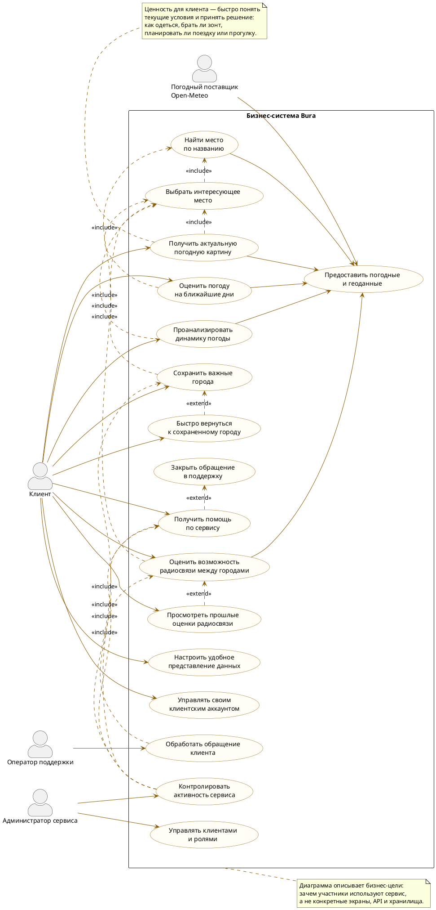

```plantuml
@startuml BuraBusinessUseCaseDiagram
left to right direction
skinparam packageStyle rectangle
skinparam shadowing false
skinparam actorStyle awesome
skinparam usecase {
  BackgroundColor #FFFDF6
  BorderColor #8A5A00
  ArrowColor #8A5A00
}

actor "Клиент" as Customer
actor "Оператор поддержки" as SupportOperator
actor "Администратор сервиса" as ServiceAdmin
actor "Погодный поставщик\nOpen-Meteo" as WeatherProvider


rectangle "Бизнес-система Bura" as BuraBusiness {
  usecase "Получить актуальную\nпогодную картину" as BU_WeatherOverview
  usecase "Выбрать интересующее\nместо" as BU_SelectLocation
  usecase "Найти место\nпо названию" as BU_FindLocation
  usecase "Оценить погоду\nна ближайшие дни" as BU_ForecastPlanning
  usecase "Проанализировать\nдинамику погоды" as BU_WeatherAnalytics
  usecase "Сохранить важные\nгорода" as BU_SaveCities
  usecase "Быстро вернуться\nк сохраненному городу" as BU_ReturnToCity
  usecase "Настроить удобное\nпредставление данных" as BU_Personalization
  usecase "Управлять своим\nклиентским аккаунтом" as BU_AccountManagement
  usecase "Получить помощь\nпо сервису" as BU_GetSupport
  usecase "Закрыть обращение\nв поддержку" as BU_CloseSupport
  usecase "Оценить возможность\nрадиосвязи между городами" as BU_RadioAssessment
  usecase "Просмотреть прошлые\nоценки радиосвязи" as BU_RadioHistory
  usecase "Обработать обращение\nклиента" as BU_HandleSupport
  usecase "Управлять клиентами\nи ролями" as BU_ManageCustomers
  usecase "Контролировать\nактивность сервиса" as BU_MonitorService
  usecase "Предоставить погодные\nи геоданные" as BU_ProvideWeatherData
}

Customer --> BU_WeatherOverview
Customer --> BU_ForecastPlanning
Customer --> BU_WeatherAnalytics
Customer --> BU_SaveCities
Customer --> BU_ReturnToCity
Customer --> BU_Personalization
Customer --> BU_AccountManagement
Customer --> BU_GetSupport
Customer --> BU_RadioAssessment
Customer --> BU_RadioHistory
SupportOperator --> BU_HandleSupport
ServiceAdmin --> BU_ManageCustomers
ServiceAdmin --> BU_MonitorService
WeatherProvider --> BU_ProvideWeatherData

BU_WeatherOverview .> BU_SelectLocation : <<include>>
BU_ForecastPlanning .> BU_SelectLocation : <<include>>
BU_WeatherAnalytics .> BU_SelectLocation : <<include>>
BU_SelectLocation .> BU_FindLocation : <<include>>
BU_SaveCities .> BU_SelectLocation : <<include>>
BU_ReturnToCity .> BU_SaveCities : <<extend>>
BU_GetSupport .> BU_CloseSupport : <<extend>>
BU_RadioAssessment .> BU_FindLocation : <<include>>
BU_RadioHistory .> BU_RadioAssessment : <<extend>>
BU_HandleSupport .> BU_GetSupport : <<include>>
BU_MonitorService .> BU_SaveCities : <<include>>
BU_MonitorService .> BU_RadioAssessment : <<include>>
BU_MonitorService .> BU_GetSupport : <<include>>

BU_FindLocation --> BU_ProvideWeatherData
BU_WeatherOverview --> BU_ProvideWeatherData
BU_ForecastPlanning --> BU_ProvideWeatherData
BU_WeatherAnalytics --> BU_ProvideWeatherData
BU_RadioAssessment --> BU_ProvideWeatherData

note right of BuraBusiness
  Диаграмма описывает бизнес-цели:
  зачем участники используют сервис,
  а не конкретные экраны, API и хранилища.
end note

note bottom of BU_WeatherOverview
  Ценность для клиента — быстро понять
  текущие условия и принять решение:
  как одеться, брать ли зонт,
  планировать ли поездку или прогулку.
end note
@enduml
```