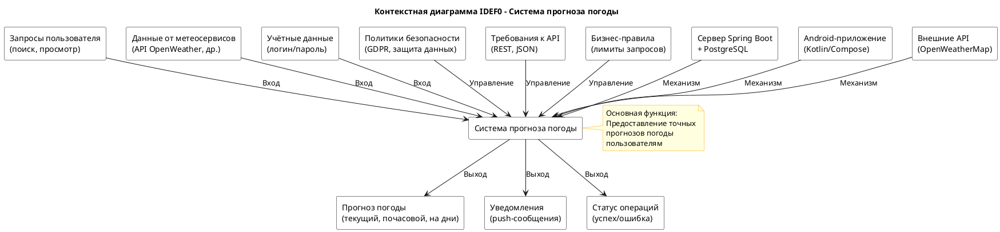

```plantuml
@startuml IDEF0_Context
skinparam rectangle {
    BackgroundColor White
    BorderColor Black
}
skinparam note {
    BackgroundColor LightYellow
    BorderColor Orange
}

title Контекстная диаграмма IDEF0 - Система прогноза погоды

rectangle "Система прогноза погоды" as System {
}

' Входы (слева)
rectangle "Запросы пользователя\n(поиск, просмотр)" as Input1
rectangle "Данные от метеосервисов\n(API OpenWeather, др.)" as Input2
rectangle "Учётные данные\n(логин/пароль)" as Input3

' Выходы (справа)
rectangle "Прогноз погоды\n(текущий, почасовой, на дни)" as Output1
rectangle "Уведомления\n(push-сообщения)" as Output2
rectangle "Статус операций\n(успех/ошибка)" as Output3

' Управление (сверху)
rectangle "Политики безопасности\n(GDPR, защита данных)" as Control1
rectangle "Требования к API\n(REST, JSON)" as Control2
rectangle "Бизнес-правила\n(лимиты запросов)" as Control3

' Механизмы (снизу)
rectangle "Сервер Spring Boot\n+ PostgreSQL" as Mechanism1
rectangle "Android-приложение\n(Kotlin/Compose)" as Mechanism2
rectangle "Внешние API\n(OpenWeatherMap)" as Mechanism3

Input1 --> System : Вход
Input2 --> System : Вход
Input3 --> System : Вход

System --> Output1 : Выход
System --> Output2 : Выход
System --> Output3 : Выход

Control1 --> System : Управление
Control2 --> System : Управление
Control3 --> System : Управление

Mechanism1 --> System : Механизм
Mechanism2 --> System : Механизм
Mechanism3 --> System : Механизм

note right of System
  Основная функция:
  Предоставление точных
  прогнозов погоды
  пользователям
end note

@enduml
```
