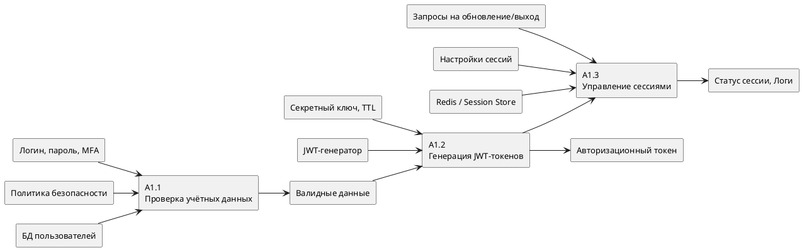

```plantuml
@startuml
left to right direction
skinparam ranksep 40
skinparam nodesep 30
skinparam defaultFontSize 13
skinparam defaultFontName SansSerif

rectangle "A1.1\nПроверка учётных данных" as A11
rectangle "A1.2\nГенерация JWT-токенов" as A12
rectangle "A1.3\nУправление сессиями" as A13

rectangle "Логин, пароль, MFA" as IN1
rectangle "Политика безопасности" as CTL1
rectangle "БД пользователей" as MEC1
rectangle "Валидные данные" as FLOW12

rectangle "Секретный ключ, TTL" as CTL2
rectangle "JWT-генератор" as MEC2
rectangle "Авторизационный токен" as OUT2

rectangle "Запросы на обновление/выход" as IN3
rectangle "Настройки сессий" as CTL3
rectangle "Redis / Session Store" as MEC3
rectangle "Статус сессии, Логи" as OUT3

IN1 --> A11
CTL1 --> A11
MEC1 --> A11
A11 --> FLOW12
FLOW12 --> A12

CTL2 --> A12
MEC2 --> A12
A12 --> OUT2
A12 --> A13

IN3 --> A13
CTL3 --> A13
MEC3 --> A13
A13 --> OUT3
@enduml
```