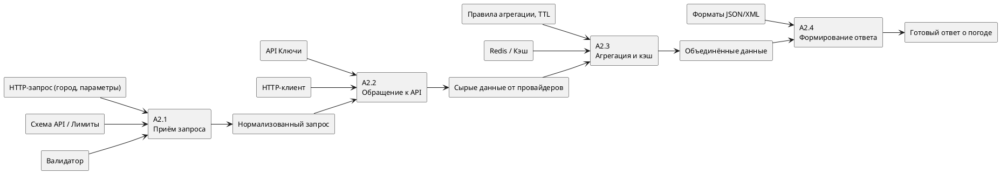

```plantuml
@startuml
left to right direction
skinparam ranksep 40
skinparam nodesep 30
skinparam defaultFontSize 13
skinparam defaultFontName SansSerif

rectangle "A2.1\nПриём запроса" as A21
rectangle "A2.2\nОбращение к API" as A22
rectangle "A2.3\nАгрегация и кэш" as A23
rectangle "A2.4\nФормирование ответа" as A24

rectangle "HTTP-запрос (город, параметры)" as IN21
rectangle "Схема API / Лимиты" as CTL21
rectangle "Валидатор" as MEC21
rectangle "Нормализованный запрос" as OUT21

rectangle "API Ключи" as CTL22
rectangle "HTTP-клиент" as MEC22
rectangle "Сырые данные от провайдеров" as OUT22

rectangle "Правила агрегации, TTL" as CTL23
rectangle "Redis / Кэш" as MEC23
rectangle "Объединённые данные" as OUT23

rectangle "Форматы JSON/XML" as CTL24
rectangle "Готовый ответ о погоде" as OUT24

IN21 --> A21
CTL21 --> A21
MEC21 --> A21
A21 --> OUT21
OUT21 --> A22

CTL22 --> A22
MEC22 --> A22
A22 --> OUT22
OUT22 --> A23

CTL23 --> A23
MEC23 --> A23
A23 --> OUT23
OUT23 --> A24

CTL24 --> A24
A24 --> OUT24
@enduml
```