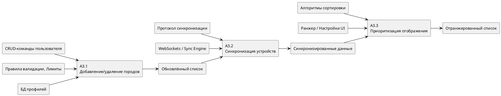

```plantuml
@startuml
left to right direction
skinparam ranksep 40
skinparam nodesep 30
skinparam defaultFontSize 13
skinparam defaultFontName SansSerif

rectangle "A3.1\nДобавление/удаление городов" as A31
rectangle "A3.2\nСинхронизация устройств" as A32
rectangle "A3.3\nПриоритизация отображения" as A33

rectangle "CRUD-команды пользователя" as IN31
rectangle "Правила валидации, Лимиты" as CTL31
rectangle "БД профилей" as MEC31
rectangle "Обновлённый список" as OUT31

rectangle "Протокол синхронизации" as CTL32
rectangle "WebSockets / Sync Engine" as MEC32
rectangle "Синхронизированные данные" as OUT32

rectangle "Алгоритмы сортировки" as CTL33
rectangle "Ранжер / Настройки UI" as MEC33
rectangle "Отранжированный список" as OUT33

IN31 --> A31
CTL31 --> A31
MEC31 --> A31
A31 --> OUT31
OUT31 --> A32

CTL32 --> A32
MEC32 --> A32
A32 --> OUT32
OUT32 --> A33

CTL33 --> A33
MEC33 --> A33
A33 --> OUT33
@enduml
```