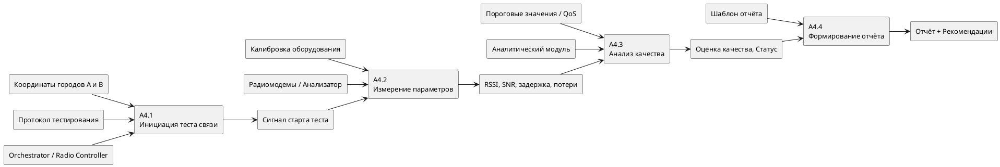

```plantuml
@startuml
left to right direction
skinparam ranksep 40
skinparam nodesep 30
skinparam defaultFontSize 13
skinparam defaultFontName SansSerif

rectangle "A4.1\nИнициация теста связи" as A41
rectangle "A4.2\nИзмерение параметров" as A42
rectangle "A4.3\nАнализ качества" as A43
rectangle "A4.4\nФормирование отчёта" as A44

rectangle "Координаты городов A и B" as IN41
rectangle "Протокол тестирования" as CTL41
rectangle "Orchestrator / Radio Controller" as MEC41
rectangle "Сигнал старта теста" as OUT41

rectangle "Калибровка оборудования" as CTL42
rectangle "Радиомодемы / Анализатор" as MEC42
rectangle "RSSI, SNR, задержка, потери" as OUT42

rectangle "Пороговые значения / QoS" as CTL43
rectangle "Аналитический модуль" as MEC43
rectangle "Оценка качества, Статус" as OUT43

rectangle "Шаблон отчёта" as CTL44
rectangle "Отчёт + Рекомендации" as OUT44

IN41 --> A41
CTL41 --> A41
MEC41 --> A41
A41 --> OUT41
OUT41 --> A42

CTL42 --> A42
MEC42 --> A42
A42 --> OUT42
OUT42 --> A43

CTL43 --> A43
MEC43 --> A43
A43 --> OUT43
OUT43 --> A44

CTL44 --> A44
A44 --> OUT44
@enduml
```