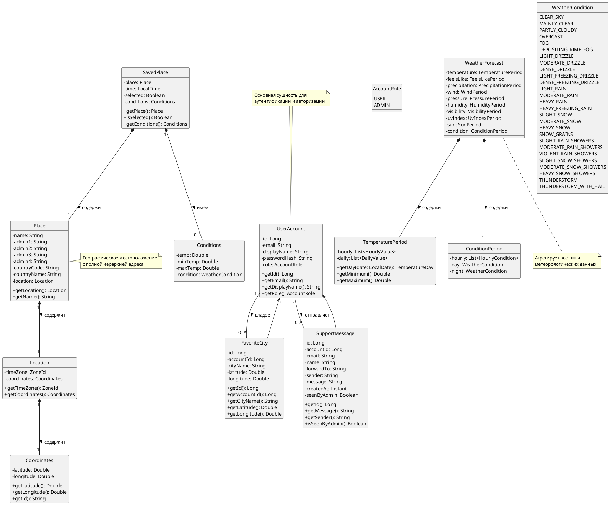

```plantuml
@startuml
skinparam classAttributeIconSize 0
hide circle

class UserAccount {
    -id: Long
    -email: String
    -displayName: String
    -passwordHash: String
    -role: AccountRole
    +getId(): Long
    +getEmail(): String
    +getDisplayName(): String
    +getRole(): AccountRole
}

enum AccountRole {
    USER
    ADMIN
}

class FavoriteCity {
    -id: Long
    -accountId: Long
    -cityName: String
    -latitude: Double
    -longitude: Double
    +getId(): Long
    +getAccountId(): Long
    +getCityName(): String
    +getLatitude(): Double
    +getLongitude(): Double
}

class SupportMessage {
    -id: Long
    -accountId: Long
    -email: String
    -name: String
    -forwardTo: String
    -sender: String
    -message: String
    -createdAt: Instant
    -seenByAdmin: Boolean
    +getId(): Long
    +getMessage(): String
    +getSender(): String
    +isSeenByAdmin(): Boolean
}

class Place {
    -name: String
    -admin1: String
    -admin2: String
    -admin3: String
    -admin4: String
    -countryCode: String
    -countryName: String
    -location: Location
    +getLocation(): Location
    +getName(): String
}

class Location {
    -timeZone: ZoneId
    -coordinates: Coordinates
    +getTimeZone(): ZoneId
    +getCoordinates(): Coordinates
}

class Coordinates {
    -latitude: Double
    -longitude: Double
    +getLatitude(): Double
    +getLongitude(): Double
    +getId(): String
}

class SavedPlace {
    -place: Place
    -time: LocalTime
    -selected: Boolean
    -conditions: Conditions
    +getPlace(): Place
    +isSelected(): Boolean
    +getConditions(): Conditions
}

class Conditions {
    -temp: Double
    -minTemp: Double
    -maxTemp: Double
    -condition: WeatherCondition
}

class WeatherForecast {
    -temperature: TemperaturePeriod
    -feelsLike: FeelsLikePeriod
    -precipitation: PrecipitationPeriod
    -wind: WindPeriod
    -pressure: PressurePeriod
    -humidity: HumidityPeriod
    -visibility: VisibilityPeriod
    -uvIndex: UvIndexPeriod
    -sun: SunPeriod
    -condition: ConditionPeriod
}

class TemperaturePeriod {
    -hourly: List<HourlyValue>
    -daily: List<DailyValue>
    +getDay(date: LocalDate): TemperatureDay
    +getMinimum(): Double
    +getMaximum(): Double
}

class ConditionPeriod {
    -hourly: List<HourlyCondition>
    -day: WeatherCondition
    -night: WeatherCondition
}

enum WeatherCondition {
    CLEAR_SKY
    MAINLY_CLEAR
    PARTLY_CLOUDY
    OVERCAST
    FOG
    DEPOSITING_RIME_FOG
    LIGHT_DRIZZLE
    MODERATE_DRIZZLE
    DENSE_DRIZZLE
    LIGHT_FREEZING_DRIZZLE
    DENSE_FREEZING_DRIZZLE
    LIGHT_RAIN
    MODERATE_RAIN
    HEAVY_RAIN
    HEAVY_FREEZING_RAIN
    SLIGHT_SNOW
    MODERATE_SNOW
    HEAVY_SNOW
    SNOW_GRAINS
    SLIGHT_RAIN_SHOWERS
    MODERATE_RAIN_SHOWERS
    VIOLENT_RAIN_SHOWERS
    SLIGHT_SNOW_SHOWERS
    MODERATE_SNOW_SHOWERS
    HEAVY_SNOW_SHOWERS
    THUNDERSTORM
    THUNDERSTORM_WITH_HAIL
}

UserAccount "1" -- "0..*" FavoriteCity : владеет >
UserAccount "1" -- "0..*" SupportMessage : отправляет >
FavoriteCity --> UserAccount
SupportMessage --> UserAccount

Place "1" *-- "1" Location : содержит >
Location "1" *-- "1" Coordinates : содержит >
SavedPlace "1" *-- "1" Place : содержит >
SavedPlace "1" *-- "0..1" Conditions : имеет >

WeatherForecast "1" *-- "1" TemperaturePeriod : содержит >
WeatherForecast "1" *-- "1" ConditionPeriod : содержит >

note top of UserAccount
  Основная сущность для
  аутентификации и авторизации
end note

note right of Place
  Географическое местоположение
  с полной иерархией адреса
end note

note bottom of WeatherForecast
  Агрегирует все типы
  метеорологических данных
end note

@enduml
```