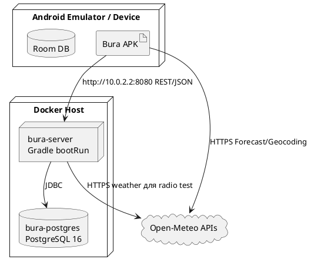

# Архитектурный обзор Bura (arc42)

Проект: **Bura**
Траектория: **Mobile (Android) + Backend (Spring Boot)**
Версия документа: **1.0**
Дата: **31.05.2026**
Автор: **Виталий Мальцев**

---

## 1. Введение и цели

### 1.1. Краткое описание системы

**Bura** — мобильное Android-приложение для просмотра погодных данных, управления избранными городами и персональных настроек пользователя. Клиентская часть построена на Kotlin, Jetpack Compose, Navigation Compose, Room и Retrofit. Прогноз погоды и поиск мест загружаются из Open-Meteo, а пользовательские функции синхронизируются с собственным backend-сервисом.

Серверная часть Bura — Spring Boot приложение на Java 21. Backend отвечает за регистрацию и вход пользователей, JWT-аутентификацию, роли USER/ADMIN, хранение избранных городов, обращений в поддержку, истории тестов радиосигнала и агрегированной пользовательской статистики.

Дополнительная особенность проекта — модуль тестирования радиосигнала между двумя городами. Пользователь вводит две точки и частоту, сервер получает погодный снимок из Open-Meteo, рассчитывает расстояние, потери на трассе, задержку, скорость и качественную оценку канала.

### 1.2. Цели архитектуры

| Цель | Описание |
|------|----------|
| Разделение ответственности | UI, навигация, состояние экранов, бизнес-операции, модели, API-клиенты и хранилища разделены по пакетам и слоям PCMEF. |
| Поддерживаемость | Новые экраны, погодные параметры и backend endpoints добавляются в отдельные модули без переписывания всей системы. |
| Офлайн-устойчивость | Приложение кэширует часть данных локально через Room, файлы и SharedPreferences. |
| Безопасность | Backend использует Spring Security, JWT, BCrypt и проверку доступа к аккаунтам через `AccountAccessEvaluator`. |
| Тестируемость | Серверные контроллеры, сервисы и security-компоненты покрываются JUnit/Spring Security тестами; Gradle проверяет минимальное покрытие 40%. |
| Расширяемость | Единый Retrofit-интерфейс для backend API и Spring Data JPA repositories позволяют добавлять новые сценарии синхронизации. |

### 1.3. Стейкхолдеры

| Стейкхолдер | Интересы |
|-------------|----------|
| Пользователь Android-приложения | Быстрый просмотр прогноза, графиков, избранных городов, настроек и личного кабинета. |
| Администратор | Просмотр пользователей, ролей, обращений в поддержку и ответ пользователям через admin panel. |
| Разработчик | Понятная модульная структура Android и backend, единые DTO, проверяемые границы слоев. |
| Проверяющий учебного проекта | Соответствие требованиям, наличие PCMEF, arc42-описания, интерфейсов, тестов и документации. |

---

## 2. Ограничения

### 2.1. Технические ограничения

| Область | Значение |
|---------|----------|
| Android | Kotlin, Jetpack Compose, Material 3, Navigation Compose, minSdk 28, targetSdk 36, Java/Kotlin target 21. |
| Локальное хранение Android | Room Database, SharedPreferences, файловый кэш прогноза. |
| Сетевой клиент Android | Retrofit, OkHttp, Kotlinx Serialization, прямые HTTPS-запросы к Open-Meteo для прогноза. |
| Backend | Java 21, Spring Boot 3.5.0, Spring Web, Spring Security, Spring Data JPA, Validation. |
| База данных backend | PostgreSQL 16 в Docker Compose. |
| Документация API | SpringDoc OpenAPI UI. |
| Аутентификация | JWT Bearer token, BCrypt для паролей. |
| Внешние сервисы | Open-Meteo Forecast API и Open-Meteo Geocoding API. |

### 2.2. Бизнес-ограничения

| Ограничение | Значение |
|-------------|----------|
| Тип проекта | Учебный мобильный проект с серверной частью. |
| Бюджет | Бесплатные/open-source технологии и публичные API. |
| Команда | Индивидуальная разработка. |
| Срок | Один учебный семестр, плановое завершение 31.05.2026. |

---

## 3. Контекст системы

### 3.1. Бизнес-контекст

Bura решает задачу персонализированного доступа к погодной информации. Пользователь регистрируется или входит в аккаунт, выбирает город, просматривает сводку, графики температуры, осадков и вероятности осадков, сохраняет избранные города, меняет единицы измерения и тему оформления.

Система также предоставляет дополнительные пользовательские функции: обращение в поддержку, просмотр статистики аккаунта и расчет качества радиосигнала между двумя городами. Администратор работает с пользователями, ролями и обращениями поддержки.

**Основные входы:** учетные данные, выбранная локация, координаты городов, настройки пользователя, сообщения поддержки.
**Основные выходы:** прогноз и графики, список избранных городов, статистика аккаунта, история радиотестов, ответы поддержки, JWT-токен.

### 3.2. Технический контекст


---

## 4. Стратегии решения

### 4.1. Стратегия декомпозиции

Система декомпозирована по PCMEF: Presentation, Control, Mediator, Entity, Foundation. На Android дополнительно выделены ViewModel-состояния как часть Control/Mediator-границы, потому что Compose UI должен получать готовые состояния, а не работать напрямую с сетью или БД.

| Слой | Android | Backend | Ответственность |
|------|---------|---------|-----------------|
| Presentation | `*Screen.kt`, `*Destination.kt`, Compose-компоненты, тема, навигация | HTML admin panel в `AdminController` | Отображение экранов, ввод пользователя, визуальные состояния. |
| Control | `AppNavHost`, `*ViewModel`, обработчики действий экранов | `*Controller`, Spring Security filter chain | Прием пользовательских/API-запросов, маршрутизация сценариев, первичная валидация. |
| Mediator | `*Repository`, use-case классы `Get*`, `Add*`, `Delete*`, converter classes | `AccountService`, `JwtService`, `AccountAccessEvaluator`, расчетные методы `RadioSignalController` | Бизнес-логика, координация нескольких источников данных, преобразование DTO/моделей. |
| Entity | Kotlin data/value classes: `Forecast`, `Place`, `Temperature`, `Humidity`, Room entities | JPA entities: `UserAccountEntity`, `FavoriteCityEntity`, `SupportMessageEntity`, `RadioSignalTestEntity`, DTO records | Предметные данные и структуры обмена. |
| Foundation | `BuraBackendApi`, `BuraDao`, `ApiProvider`, Room, SharedPreferences, файловый кэш, Open-Meteo downloader | Spring Data JPA repositories, PostgreSQL, `RestClient`, `application*.yml`, Docker Compose | Доступ к внешним API, БД, локальным файлам, инфраструктурной конфигурации. |

Подробное описание слоев вынесено в [`PCMEF.md`](PCMEF.md).

### 4.2. Стратегия управления данными

- **Погодные данные** загружаются Android-клиентом из Open-Meteo Forecast API, преобразуются в `ForecastData`/`Forecast` и кэшируются локально.
- **Поиск мест** выполняется через Open-Meteo Geocoding API.
- **Пользовательские данные** хранятся на backend в PostgreSQL и синхронизируются с Android через REST API.
- **Локальные пользовательские данные** дублируются в Room для аккаунта, избранного, обращений поддержки и радиотестов.
- **Настройки** выбранного места, единиц измерения, темы и auth-session хранятся в SharedPreferences/локальном хранилище приложения.

### 4.3. Стратегия безопасности

- Регистрация и вход возвращают JWT, который Android отправляет в заголовке `Authorization: Bearer ...`.
- Пароли хранятся на backend только в виде BCrypt-хеша.
- Spring Security защищает `/api/**`; публичными остаются login/register и необходимые служебные endpoints.
- Доступ к данным аккаунта проверяется выражением `@accountAccess.canAccess(#accountId, authentication)`.
- Роль `ADMIN` открывает `/api/admin/**` и `/admin/panel`.
- При HTTP 401 Android-клиент очищает локальную auth-session.

---

## 5. Вид компонентов

### 5.1. Основные компоненты Android

| Компонент | Назначение |
|-----------|------------|
| `App`, `MainActivity`, `AppContainer` | Точка входа, Composition Root и ручная сборка зависимостей. |
| `AppNavHost` | Навигация между Home, Favorites, Account, Support, RadioSignal, Graphs и Settings. |
| `forecast` | Загрузка, кэширование и конвертация прогноза Open-Meteo. |
| `summary`, `graphs` | Подготовка погодных сводок и графиков для UI. |
| `place` | Выбор, поиск, сохранение и синхронизация мест/избранных городов. |
| `account`, `auth` | Регистрация, вход, сессия, профиль, смена имени/пароля, удаление аккаунта. |
| `support` | Отправка и локальное сохранение обращений в поддержку. |
| `radio` | Запуск расчета радиосигнала и просмотр истории. |
| `platform.remote`, `platform.local` | Retrofit API и Room DAO/entities. |

### 5.2. Основные компоненты backend

| Компонент | Назначение |
|-----------|------------|
| `account` | Аккаунты, роли, регистрация, вход, изменение профиля, удаление аккаунта. |
| `security` | JWT, фильтр аутентификации, правила Spring Security, OpenAPI config, проверка доступа к аккаунту. |
| `favorite` | CRUD избранных городов пользователя. |
| `support` | Диалог пользователя с поддержкой и admin endpoints. |
| `signal` | История и расчет тестов радиосигнала. |
| `stats` | Агрегированная статистика пользователя. |
| `admin` | Dashboard, список аккаунтов, смена роли, HTML-панель администратора. |

### 5.3. Интерфейсы между слоями

Ключевые интерфейсы проекта описаны в [`interface.md`](interface.md). В кратком виде:

- Android Presentation/Control обращается к repository/use-case классам.
- Android Foundation предоставляет `BuraBackendApi` для REST и `BuraDao` для локальной Room БД.
- Backend Control представлен REST controllers.
- Backend Foundation представлен Spring Data JPA interfaces.
- Внешние HTTP-интерфейсы: Open-Meteo Forecast/Geocoding и REST API Bura.

---

## 6. Вид выполнения

### 6.1. Вход пользователя

```text
AuthDestination → AccountRepository.login → BuraBackendApi.login
→ AccountController.login → AccountService.login → UserAccountRepository
→ JwtService.createToken → Android сохраняет token/accountId → переход в AppNavHost
```

### 6.2. Просмотр прогноза

```text
SummaryScreen → SummaryViewModel → ForecastRepository
→ ForecastDataCacher проверяет кэш
→ ForecastDataDownloader запрашивает Open-Meteo при необходимости
→ ForecastConverter собирает доменный Forecast
→ Get* summary use-cases → SummaryState.Success → Compose UI
```

### 6.3. Синхронизация избранных городов

```text
FavoritesDestination → SavedPlacesRepository / FavoritesSyncRepository
→ BuraBackendApi.favorites/addFavorite/deleteFavorite
→ FavoriteCityController → FavoriteCityRepository → PostgreSQL
→ ответ DTO → Room BuraDao → UI
```

### 6.4. Тест радиосигнала

```text
RadioSignalDestination → RadioSignalRepository.runSignalTest
→ BuraBackendApi.runSignalTest
→ RadioSignalController.calculate
→ Open-Meteo current weather snapshots
→ расчет distance/path loss/quality/latency/speed
→ RadioSignalTestRepository.save → PostgreSQL
→ ответ DTO → Room cache → UI
```

### 6.5. Обращение в поддержку

```text
SupportDestination → SupportRepository.sendMessage
→ BuraBackendApi.sendSupportMessage
→ SupportController.sendAccountMessage
→ SupportMessageRepository.save → PostgreSQL
→ admin panel /api/admin/support/** показывает диалог и позволяет ответить
```

---

## 7. Вид развертывания

### 7.1. Локальная схема



### 7.2. Запуск backend-инфраструктуры

Backend и PostgreSQL запускаются через `docker-compose.yml`. Контейнер `server` использует Gradle image `gradle:8.14.3-jdk21`, выполняет `./gradlew :server:bootRun --no-daemon` и публикует порт `8080`. Контейнер `postgres` использует `postgres:16-alpine` и порт `5432`.

Минимальный запуск:

```bash
cp .env.example .env # если шаблон есть в окружении проекта
docker compose up --build
```

Для Android emulator backend доступен по адресу `http://10.0.2.2:8080/`.

---

## 8. Скрещенные концепции

### 8.1. Ошибки и состояния UI

ViewModel публикуют sealed-state модели (`SummaryState`, `EssentialGraphsState`, `ForecastResult`): успешное состояние, загрузка, ошибка загрузки, устаревший кэш, отсутствие выбранного места. Это исключает передачу неполных данных в Compose UI.

### 8.2. DTO и сериализация

Android использует Kotlinx Serialization DTO в `platform.remote`. Backend использует Java records для request/response DTO. Имена полей DTO синхронизированы с JSON-контрактом REST API.

### 8.3. Валидация

Backend применяет Jakarta Validation (`@Valid`, `@NotBlank`, `@Email`) на входных DTO. Ошибки домена и доступа возвращаются как HTTP-статусы через Spring MVC/Security.

### 8.4. Кэширование

Приложение кэширует:

- прогноз — файловым кэшем через `ForecastDataCacher`;
- аккаунт, избранное, поддержку и радиотесты — Room;
- сессию, выбранное место и настройки — SharedPreferences.

### 8.5. Наблюдаемость и документация

SpringDoc OpenAPI подключен для backend API. Для тестов backend генерируются JUnit и JaCoCo отчеты.

---

## 9. Архитектурные решения

| № | Решение | Статус | Обоснование |
|---|---------|--------|-------------|
| [ADR-001](adr/adr-001.md) | Использовать PCMEF как архитектурную декомпозицию | Принято | Требуется разделить UI, управление, бизнес-логику, сущности и инфраструктуру. |
| [ADR-002](adr/adr-002.md) | Использовать нативный Android + Jetpack Compose | Принято | Современный UI, Material 3, интеграция с Android SDK и Room. |
| [ADR-003](adr/adr-003.md) | Использовать Spring Boot backend | Принято | Быстрая реализация REST, security, validation, JPA и OpenAPI. |
| [ADR-004](adr/adr-004.md) | Использовать PostgreSQL и Spring Data JPA | Принято | Надежное хранение пользовательских данных и простой repository layer. |
| [ADR-005](adr/adr-005.md) | Использовать JWT Bearer auth | Принято | Stateless backend и простая интеграция с мобильным клиентом. |
| [ADR-006](adr/adr-006.md) | Использовать Open-Meteo как внешний погодный источник | Принято | Бесплатный API для прогноза, геокодинга и текущих погодных данных. |

---

## 10. Качество

| Атрибут | Целевое значение | Способ проверки |
|---------|------------------|-----------------|
| Тестируемость backend | Минимум 40% покрытия | `./gradlew :server:test :server:jacocoTestCoverageVerification` |
| Безопасность endpoints | Доступ только к своему accountId или ADMIN | Spring Security tests и `@PreAuthorize`. |
| Поддерживаемость | Один функциональный модуль — один пакет/набор классов | Code review структуры пакетов. |
| Производительность UI | Compose получает готовые immutable/sealed состояния | Проверка ViewModel и отсутствия сетевых вызовов из UI. |
| Устойчивость к сети | Прогноз и пользовательские данные частично доступны из кэша | Проверка Room/file cache сценариев. |

---

## 11. Риски

| Риск | Последствие | Митигация |
|------|-------------|-----------|
| Недоступность Open-Meteo | Нет свежего прогноза или weather snapshot для радиотеста | Локальный кэш прогноза, обработка `FailedToDownload`, таймауты HTTP. |
| Утечка JWT на устройстве | Компрометация аккаунта | Ограниченный срок действия JWT, очистка сессии при 401, хранение секретов backend через env. |
| Несинхронность DTO клиента и backend | Runtime ошибки сериализации | Единый документ интерфейсов, Retrofit DTO и Java records с одинаковыми полями. |
| Рост логики в controllers | Сложность тестирования | Вынос бизнес-операций в services/use-cases при расширении модулей. |
| Destructive Room migration в разработке | Потеря локального кэша при смене схемы | Для учебного проекта допустимо; для production нужны явные миграции. |

---

## 12. Глоссарий

| Термин | Определение |
|--------|-------------|
| PCMEF | Presentation, Control, Mediator, Entity, Foundation — послойная архитектурная модель. |
| DTO | Data Transfer Object — объект обмена между слоями или по API. |
| JWT | JSON Web Token для stateless-аутентификации. |
| Room | Android ORM/SQLite layer для локального хранения. |
| Retrofit | HTTP client library для типизированного REST API на Android. |
| JPA | Java Persistence API для ORM на backend. |
| Open-Meteo | Внешний погодный и геокодинговый API. |
| Compose | Декларативный UI toolkit Android. |
