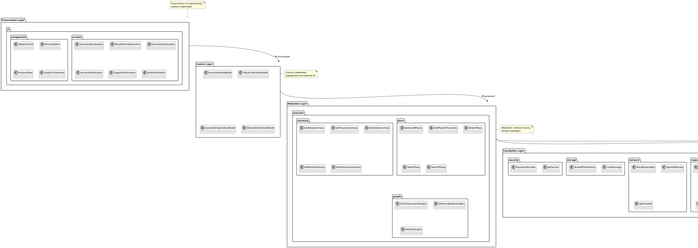

```plantuml
@startuml
package "Presentation Layer" as presentation {
    package "ui.screens" {
        class SummaryDestination
        class PlacePickerDestination
        class FavoritesDestination
        class AccountDestination
        class SupportDestination
        class AuthDestination
    }
    package "ui.components" {
        class WeatherCard
        class PlaceListItem
        class ForecastRow
        class GraphComponent
    }
}

package "Control Layer" as control {
    class SummaryViewModel
    class PlacePickerViewModel
    class EssentialGraphsViewModel
    class SelectedUnitsViewModel
}

package "Mediation Layer" as mediation {
    package "usecases.place" {
        class GetSavedPlaces
        class AddPlaceToFavorites
        class DeletePlace
        class SelectPlace
        class SearchPlaces
    }
    package "usecases.summary" {
        class GetNowSummary
        class GetHourlySummary
        class GetDailySummary
        class GetWindSummary
        class GetPressureSummary
    }
    package "usecases.graphs" {
        class GetTemperatureGraphs
        class GetPrecipitationGraphs
        class GetPopGraphs
    }
}

package "Entity Layer" as entity {
    package "models" {
        class Place
        class SavedPlace
        class WeatherForecast
        class UserAccount
        class SupportMessage
    }
    package "dto" {
        class LoginRequest
        class RegisterRequest
        class FavoriteCityRequestDto
        class AccountResponse
    }
}

package "Foundation Layer" as foundation {
    package "repositories" {
        class SavedPlacesRepository
        class SelectedPlaceRepository
        class ForecastRepository
        class AccountRepository
        class AuthSessionRepository
    }
    package "network" {
        class BuraBackendApi
        class OpenMeteoApi
        class ApiProvider
    }
    package "storage" {
        class LocalStorage
        class SharedPreferences
    }
    package "security" {
        class JwtService
        class PasswordEncoder
    }
}

presentation --> control : использует >
control --> mediation : вызывает >
mediation --> entity : оперирует >
mediation --> foundation : использует >
foundation --> entity : сериализует >

note top of presentation
  Presentation: UI компоненты,
  экраны, навигация
end note

note right of control
  Control: ViewModel,
  управление состоянием UI
end note

note right of mediation
  Mediation: UseCase классы,
  бизнес-сценарии
end note

note bottom of entity
  Entity: Модели данных,
  DTO, сущности
end note

note left of foundation
  Foundation: Репозитории,
  сеть, хранение, безопасность
end note

@enduml
```
