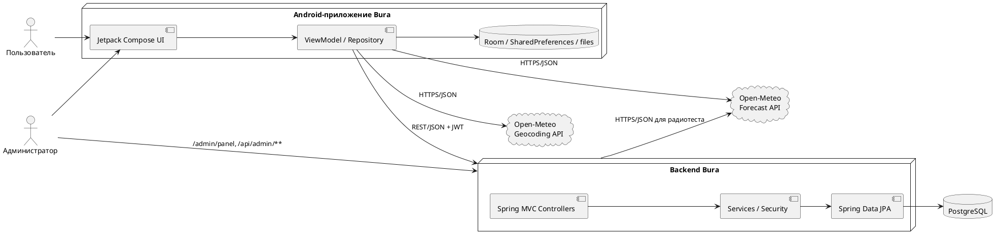

```plantuml
@startuml
left to right direction

actor "Пользователь" as User
actor "Администратор" as Admin
cloud "Open-Meteo\nForecast API" as ForecastApi
cloud "Open-Meteo\nGeocoding API" as GeoApi

node "Android-приложение Bura" as Android {
  component "Jetpack Compose UI" as UI
  component "ViewModel / Repository" as ClientLogic
  database "Room / SharedPreferences / files" as LocalStore
}

node "Backend Bura" as Backend {
  component "Spring MVC Controllers" as Controllers
  component "Services / Security" as Services
  component "Spring Data JPA" as Jpa
}

database "PostgreSQL" as DB

User --> UI
Admin --> UI
UI --> ClientLogic
ClientLogic --> LocalStore
ClientLogic --> Backend : REST/JSON + JWT
ClientLogic --> ForecastApi : HTTPS/JSON
ClientLogic --> GeoApi : HTTPS/JSON
Backend --> ForecastApi : HTTPS/JSON для радиотеста
Controllers --> Services
Services --> Jpa
Jpa --> DB
Admin --> Backend : /admin/panel, /api/admin/**
@enduml
```