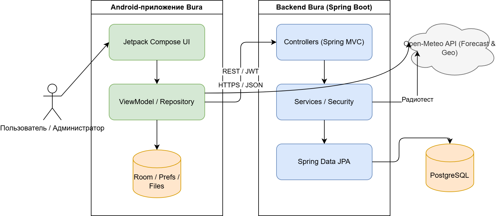
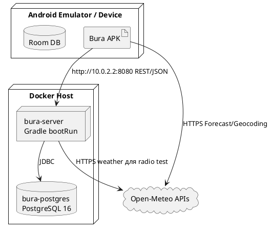
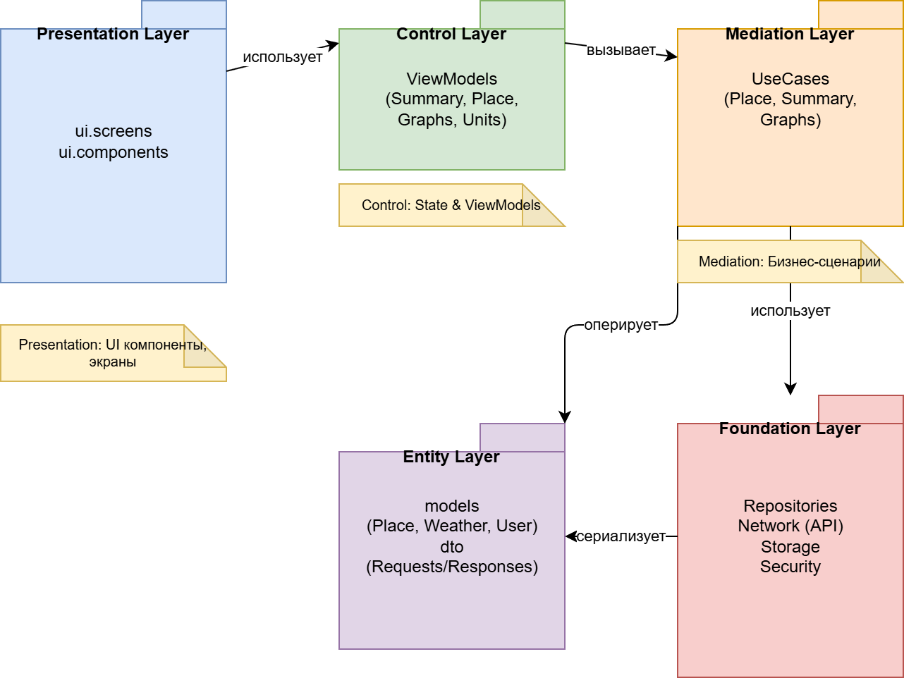

# Документация архитектуры Bura

Этот файл объединяет Markdown-документы раздела `docs/02-architecture`:

1. [`arc42-overview.md`](arc42-overview.md) — архитектурный обзор по шаблону arc42.
2. [`PCMEF.md`](PCMEF.md) — описание PCMEF-слоев проекта.
3. [`interface.md`](interface.md) — описание интерфейсов проекта.
4. [`adr/`](adr/) — отдельные Architecture Decision Records:
   - [ADR-001: Использовать PCMEF как архитектурную декомпозицию](adr/adr-001.md)
   - [ADR-002: Использовать нативный Android + Jetpack Compose](adr/adr-002.md)
   - [ADR-003: Использовать Spring Boot backend](adr/adr-003.md)
   - [ADR-004: Использовать PostgreSQL и Spring Data JPA](adr/adr-004.md)
   - [ADR-005: Использовать JWT Bearer auth](adr/adr-005.md)
   - [ADR-006: Использовать Open-Meteo как внешний погодный источник](adr/adr-006.md)

---

# Архитектурный обзор Bura (arc42)

Проект: **Bura**
Траектория: **Mobile (Android) + Backend (Spring Boot)**
Версия документа: **1.0**
Дата: **31.05.2026**
Автор: **Виталий Мальцев**

---

## 1. Введение и цели

### 1.1. Краткое описание системы

**Bura** — мобильное Android-приложение для просмотра погодных данных, управления избранными городами и персональных настроек пользователя. Клиентская часть построена на Kotlin, Jetpack Compose, Navigation Compose, Room и Retrofit. Прогноз погоды и поиск мест загружаются из Open-Meteo, а пользовательские функции синхронизируются с собственным backend-сервисом.

Серверная часть Bura — Spring Boot приложение на Java 21. Backend отвечает за регистрацию и вход пользователей, JWT-аутентификацию, роли USER/ADMIN, хранение избранных городов, обращений в поддержку, истории тестов радиосигнала и агрегированной пользовательской статистики.

Дополнительная особенность проекта — модуль тестирования радиосигнала между двумя городами. Пользователь вводит две точки и частоту, сервер получает погодный снимок из Open-Meteo, рассчитывает расстояние, потери на трассе, задержку, скорость и качественную оценку канала.

### 1.2. Цели архитектуры

| Цель | Описание |
|------|----------|
| Разделение ответственности | UI, навигация, состояние экранов, бизнес-операции, модели, API-клиенты и хранилища разделены по пакетам и слоям PCMEF. |
| Поддерживаемость | Новые экраны, погодные параметры и backend endpoints добавляются в отдельные модули без переписывания всей системы. |
| Офлайн-устойчивость | Приложение кэширует часть данных локально через Room, файлы и SharedPreferences. |
| Безопасность | Backend использует Spring Security, JWT, BCrypt и проверку доступа к аккаунтам через `AccountAccessEvaluator`. |
| Тестируемость | Серверные контроллеры, сервисы и security-компоненты покрываются JUnit/Spring Security тестами; Gradle проверяет минимальное покрытие 40%. |
| Расширяемость | Единый Retrofit-интерфейс для backend API и Spring Data JPA repositories позволяют добавлять новые сценарии синхронизации. |

### 1.3. Стейкхолдеры

| Стейкхолдер | Интересы |
|-------------|----------|
| Пользователь Android-приложения | Быстрый просмотр прогноза, графиков, избранных городов, настроек и личного кабинета. |
| Администратор | Просмотр пользователей, ролей, обращений в поддержку и ответ пользователям через admin panel. |
| Разработчик | Понятная модульная структура Android и backend, единые DTO, проверяемые границы слоев. |
| Проверяющий учебного проекта | Соответствие требованиям, наличие PCMEF, arc42-описания, интерфейсов, тестов и документации. |

---

## 2. Ограничения

### 2.1. Технические ограничения

| Область | Значение |
|---------|----------|
| Android | Kotlin, Jetpack Compose, Material 3, Navigation Compose, minSdk 28, targetSdk 36, Java/Kotlin target 21. |
| Локальное хранение Android | Room Database, SharedPreferences, файловый кэш прогноза. |
| Сетевой клиент Android | Retrofit, OkHttp, Kotlinx Serialization, прямые HTTPS-запросы к Open-Meteo для прогноза. |
| Backend | Java 21, Spring Boot 3.5.0, Spring Web, Spring Security, Spring Data JPA, Validation. |
| База данных backend | PostgreSQL 16 в Docker Compose. |
| Документация API | SpringDoc OpenAPI UI. |
| Аутентификация | JWT Bearer token, BCrypt для паролей. |
| Внешние сервисы | Open-Meteo Forecast API и Open-Meteo Geocoding API. |

### 2.2. Бизнес-ограничения

| Ограничение | Значение |
|-------------|----------|
| Тип проекта | Учебный мобильный проект с серверной частью. |
| Бюджет | Бесплатные/open-source технологии и публичные API. |
| Команда | Индивидуальная разработка. |
| Срок | Один учебный семестр, плановое завершение 31.05.2026. |

---

## 3. Контекст системы

### 3.1. Бизнес-контекст

Bura решает задачу персонализированного доступа к погодной информации. Пользователь регистрируется или входит в аккаунт, выбирает город, просматривает сводку, графики температуры, осадков и вероятности осадков, сохраняет избранные города, меняет единицы измерения и тему оформления.

Система также предоставляет дополнительные пользовательские функции: обращение в поддержку, просмотр статистики аккаунта и расчет качества радиосигнала между двумя городами. Администратор работает с пользователями, ролями и обращениями поддержки.

**Основные входы:** учетные данные, выбранная локация, координаты городов, настройки пользователя, сообщения поддержки.
**Основные выходы:** прогноз и графики, список избранных городов, статистика аккаунта, история радиотестов, ответы поддержки, JWT-токен.

### 3.2. Технический контекст



---

## 4. Стратегии решения

### 4.1. Стратегия декомпозиции

Система декомпозирована по PCMEF: Presentation, Control, Mediator, Entity, Foundation. На Android дополнительно выделены ViewModel-состояния как часть Control/Mediator-границы, потому что Compose UI должен получать готовые состояния, а не работать напрямую с сетью или БД.

| Слой | Android | Backend | Ответственность |
|------|---------|---------|-----------------|
| Presentation | `*Screen.kt`, `*Destination.kt`, Compose-компоненты, тема, навигация | HTML admin panel в `AdminController` | Отображение экранов, ввод пользователя, визуальные состояния. |
| Control | `AppNavHost`, `*ViewModel`, обработчики действий экранов | `*Controller`, Spring Security filter chain | Прием пользовательских/API-запросов, маршрутизация сценариев, первичная валидация. |
| Mediator | `*Repository`, use-case классы `Get*`, `Add*`, `Delete*`, converter classes | `AccountService`, `FavoriteCityService`, `RadioSignalService`, `SupportService`, `UserStatsService`, `AdminService`, `JwtService`, `AccountAccessEvaluator` | Бизнес-логика, координация нескольких источников данных, преобразование DTO/моделей. |
| Entity | Kotlin data/value classes: `Forecast`, `Place`, `Temperature`, `Humidity`, Room entities | JPA entities: `UserAccountEntity`, `FavoriteCityEntity`, `SupportMessageEntity`, `RadioSignalTestEntity`, DTO records | Предметные данные и структуры обмена. |
| Foundation | `BuraBackendApi`, `BuraDao`, `ApiProvider`, Room, SharedPreferences, файловый кэш, Open-Meteo downloader | Spring Data JPA repositories, PostgreSQL, `RestClient`, `application*.yml`, Docker Compose | Доступ к внешним API, БД, локальным файлам, инфраструктурной конфигурации. |

Подробное описание слоев вынесено в [`PCMEF.md`](PCMEF.md).

### 4.2. Стратегия управления данными

- **Погодные данные** загружаются Android-клиентом из Open-Meteo Forecast API, преобразуются в `ForecastData`/`Forecast` и кэшируются локально.
- **Поиск мест** выполняется через Open-Meteo Geocoding API.
- **Пользовательские данные** хранятся на backend в PostgreSQL и синхронизируются с Android через REST API.
- **Локальные пользовательские данные** дублируются в Room для аккаунта, избранного, обращений поддержки и радиотестов.
- **Настройки** выбранного места, единиц измерения, темы и auth-session хранятся в SharedPreferences/локальном хранилище приложения.

### 4.3. Стратегия безопасности

- Регистрация и вход возвращают JWT, который Android отправляет в заголовке `Authorization: Bearer ...`.
- Пароли хранятся на backend только в виде BCrypt-хеша.
- Spring Security защищает `/api/**`; публичными остаются login/register и необходимые служебные endpoints.
- Доступ к данным аккаунта проверяется выражением `@accountAccess.canAccess(#accountId, authentication)`.
- Роль `ADMIN` открывает `/api/admin/**` и `/admin/panel`.
- При HTTP 401 Android-клиент очищает локальную auth-session.

---

## 5. Вид компонентов

### 5.1. Основные компоненты Android

| Компонент | Назначение |
|-----------|------------|
| `App`, `MainActivity`, `AppContainer` | Точка входа, Composition Root и ручная сборка зависимостей. |
| `AppNavHost` | Навигация между Home, Favorites, Account, Support, RadioSignal, Graphs и Settings. |
| `forecast` | Загрузка, кэширование и конвертация прогноза Open-Meteo. |
| `summary`, `graphs` | Подготовка погодных сводок и графиков для UI. |
| `place` | Выбор, поиск, сохранение и синхронизация мест/избранных городов. |
| `account`, `auth` | Регистрация, вход, сессия, профиль, смена имени/пароля, удаление аккаунта. |
| `support` | Отправка и локальное сохранение обращений в поддержку. |
| `radio` | Запуск расчета радиосигнала и просмотр истории. |
| `platform.remote`, `platform.local` | Retrofit API и Room DAO/entities. |

### 5.2. Основные компоненты backend

| Компонент | Назначение |
|-----------|------------|
| `account` | Аккаунты, роли, регистрация, вход, изменение профиля, удаление аккаунта. |
| `security` | JWT, фильтр аутентификации, правила Spring Security, OpenAPI config, проверка доступа к аккаунту. |
| `favorite` | CRUD избранных городов пользователя. |
| `support` | Диалог пользователя с поддержкой и admin endpoints. |
| `signal` | История и расчет тестов радиосигнала. |
| `stats` | Агрегированная статистика пользователя. |
| `admin` | Dashboard, список аккаунтов, смена роли, HTML-панель администратора. |

### 5.3. Интерфейсы между слоями

Ключевые интерфейсы проекта описаны в [`interface.md`](interface.md). В кратком виде:

- Android Presentation/Control обращается к repository/use-case классам.
- Android Foundation предоставляет `BuraBackendApi` для REST и `BuraDao` для локальной Room БД.
- Backend Control представлен REST controllers.
- Backend Foundation представлен Spring Data JPA interfaces.
- Внешние HTTP-интерфейсы: Open-Meteo Forecast/Geocoding и REST API Bura.

---

## 6. Вид выполнения

### 6.1. Вход пользователя

```text
AuthDestination → AccountRepository.login → BuraBackendApi.login
→ AccountController.login → AccountService.login → UserAccountRepository
→ JwtService.createToken → Android сохраняет token/accountId → переход в AppNavHost
```

### 6.2. Просмотр прогноза

```text
SummaryScreen → SummaryViewModel → ForecastRepository
→ ForecastDataCacher проверяет кэш
→ ForecastDataDownloader запрашивает Open-Meteo при необходимости
→ ForecastConverter собирает доменный Forecast
→ Get* summary use-cases → SummaryState.Success → Compose UI
```

### 6.3. Синхронизация избранных городов

```text
FavoritesDestination → SavedPlacesRepository / FavoritesSyncRepository
→ BuraBackendApi.favorites/addFavorite/deleteFavorite
→ FavoriteCityController → FavoriteCityRepository → PostgreSQL
→ ответ DTO → Room BuraDao → UI
```

### 6.4. Тест радиосигнала

```text
RadioSignalDestination → RadioSignalRepository.runSignalTest
→ BuraBackendApi.runSignalTest
→ RadioSignalController.calculate
→ Open-Meteo current weather snapshots
→ расчет distance/path loss/quality/latency/speed
→ RadioSignalTestRepository.save → PostgreSQL
→ ответ DTO → Room cache → UI
```

### 6.5. Обращение в поддержку

```text
SupportDestination → SupportRepository.sendMessage
→ BuraBackendApi.sendSupportMessage
→ SupportController.sendAccountMessage
→ SupportMessageRepository.save → PostgreSQL
→ admin panel /api/admin/support/** показывает диалог и позволяет ответить
```

---

## 7. Вид развертывания

### 7.1. Локальная схема



### 7.2. Запуск backend-инфраструктуры

Backend и PostgreSQL запускаются через `docker-compose.yml`. Контейнер `server` использует Gradle image `gradle:8.14.3-jdk21`, выполняет `./gradlew :server:bootRun --no-daemon` и публикует порт `8080`. Контейнер `postgres` использует `postgres:16-alpine` и порт `5432`.

Минимальный запуск:

```bash
cp .env.example .env # если шаблон есть в окружении проекта
docker compose up --build
```

Для Android emulator backend доступен по адресу `http://10.0.2.2:8080/`.

---

## 8. Скрещенные концепции

### 8.1. Ошибки и состояния UI

ViewModel публикуют sealed-state модели (`SummaryState`, `EssentialGraphsState`, `ForecastResult`): успешное состояние, загрузка, ошибка загрузки, устаревший кэш, отсутствие выбранного места. Это исключает передачу неполных данных в Compose UI.

### 8.2. DTO и сериализация

Android использует Kotlinx Serialization DTO в `platform.remote`. Backend использует Java records для request/response DTO. Имена полей DTO синхронизированы с JSON-контрактом REST API.

### 8.3. Валидация

Backend применяет Jakarta Validation (`@Valid`, `@NotBlank`, `@Email`) на входных DTO. Ошибки домена и доступа возвращаются как HTTP-статусы через Spring MVC/Security.

### 8.4. Кэширование

Приложение кэширует:

- прогноз — файловым кэшем через `ForecastDataCacher`;
- аккаунт, избранное, поддержку и радиотесты — Room;
- сессию, выбранное место и настройки — SharedPreferences.

### 8.5. Наблюдаемость и документация

SpringDoc OpenAPI подключен для backend API. Для тестов backend генерируются JUnit и JaCoCo отчеты.

---

## 9. Архитектурные решения

| № | Решение | Статус | Обоснование |
|---|---------|--------|-------------|
| [ADR-001](adr/adr-001.md) | Использовать PCMEF как архитектурную декомпозицию | Принято | Требуется разделить UI, управление, бизнес-логику, сущности и инфраструктуру. |
| [ADR-002](adr/adr-002.md) | Использовать нативный Android + Jetpack Compose | Принято | Современный UI, Material 3, интеграция с Android SDK и Room. |
| [ADR-003](adr/adr-003.md) | Использовать Spring Boot backend | Принято | Быстрая реализация REST, security, validation, JPA и OpenAPI. |
| [ADR-004](adr/adr-004.md) | Использовать PostgreSQL и Spring Data JPA | Принято | Надежное хранение пользовательских данных и простой repository layer. |
| [ADR-005](adr/adr-005.md) | Использовать JWT Bearer auth | Принято | Stateless backend и простая интеграция с мобильным клиентом. |
| [ADR-006](adr/adr-006.md) | Использовать Open-Meteo как внешний погодный источник | Принято | Бесплатный API для прогноза, геокодинга и текущих погодных данных. |

---

## 10. Качество

| Атрибут | Целевое значение | Способ проверки |
|---------|------------------|-----------------|
| Тестируемость backend | Минимум 40% покрытия | `./gradlew :server:test :server:jacocoTestCoverageVerification` |
| Безопасность endpoints | Доступ только к своему accountId или ADMIN | Spring Security tests и `@PreAuthorize`. |
| Поддерживаемость | Один функциональный модуль — один пакет/набор классов | Code review структуры пакетов. |
| Производительность UI | Compose получает готовые immutable/sealed состояния | Проверка ViewModel и отсутствия сетевых вызовов из UI. |
| Устойчивость к сети | Прогноз и пользовательские данные частично доступны из кэша | Проверка Room/file cache сценариев. |

---

## 11. Риски

| Риск | Последствие | Митигация |
|------|-------------|-----------|
| Недоступность Open-Meteo | Нет свежего прогноза или weather snapshot для радиотеста | Локальный кэш прогноза, обработка `FailedToDownload`, таймауты HTTP. |
| Утечка JWT на устройстве | Компрометация аккаунта | Ограниченный срок действия JWT, очистка сессии при 401, хранение секретов backend через env. |
| Несинхронность DTO клиента и backend | Runtime ошибки сериализации | Единый документ интерфейсов, Retrofit DTO и Java records с одинаковыми полями. |
| Рост логики в controllers | Сложность тестирования | Вынос бизнес-операций в services/use-cases при расширении модулей. |
| Destructive Room migration в разработке | Потеря локального кэша при смене схемы | Для учебного проекта допустимо; для production нужны явные миграции. |

---

## 12. Глоссарий

| Термин | Определение |
|--------|-------------|
| PCMEF | Presentation, Control, Mediator, Entity, Foundation — послойная архитектурная модель. |
| DTO | Data Transfer Object — объект обмена между слоями или по API. |
| JWT | JSON Web Token для stateless-аутентификации. |
| Room | Android ORM/SQLite layer для локального хранения. |
| Retrofit | HTTP client library для типизированного REST API на Android. |
| JPA | Java Persistence API для ORM на backend. |
| Open-Meteo | Внешний погодный и геокодинговый API. |
| Compose | Декларативный UI toolkit Android. |

---

# Диаграмма пакетов (PCMEF)
Диаграмма пакетов иллюстрирует организацию кода приложения согласно шаблону PCMEF. Каждый пакет соответствует определённому уровню архитектуры и содержит компоненты с аналогичной ответственностью. Зависимости между пакетами направлены от верхних уровней к нижним, что обеспечивает соблюдение принципа инверсии зависимостей.

Уровень Presentation содержит компоненты пользовательского интерфейса, включая экраны (Destinations), компонуемые функции Compose и визуальные элементы. Данный уровень не содержит бизнес-логики и зависит от ViewModel для получения данных и обработки действий пользователя.

Уровень Control включает ViewModel классы, которые управляют состоянием UI и координируют выполнение бизнес-операций. ViewModel используют UseCase классы для инкапсуляции конкретных сценариев использования.

Уровень Mediation состоит из UseCase классов, каждый из которых реализует отдельную бизнес-операцию. UseCase классы используют репозитории для доступа к данным и обеспечивают переиспользование бизнес-логики.

Уровень Entity содержит модели данных, включая сущности предметной области и DTO для передачи данных между слоями. Сущности не зависят от других уровней и представляют чистые POJO/POTO объекты.

Уровень Foundation включает технические компоненты, такие как репозитории, сетевые клиенты, хранилища и утилиты. Данный уровень предоставляет инфраструктурную поддержку для всех остальных уровней.





# PCMEF-слои в проекте Bura

## 1. Назначение документа

Документ описывает, как архитектурная модель **PCMEF** применяется в Bura. Проект состоит из Android-клиента и Spring Boot backend, поэтому слои представлены в обеих частях системы.

**PCMEF**:

- **P — Presentation**: отображение и пользовательский ввод.
- **C — Control**: маршрутизация действий, прием запросов, управление состоянием сценария.
- **M — Mediator**: бизнес-логика и координация нескольких источников данных.
- **E — Entity**: доменные сущности, DTO, value objects.
- **F — Foundation**: инфраструктура, БД, API-клиенты, файловое хранилище, конфигурация.

---

## 2. Общий поток данных

```text
Android UI
  → ViewModel / Destination handlers
  → Repository / Use-case
  → Retrofit API или локальный DAO / Open-Meteo downloader
  → Backend Controller
  → Service / Security / Calculation logic
  → JPA Repository
  → PostgreSQL
```

Для погодных сценариев Android может обращаться напрямую к Open-Meteo:

```text
SummaryScreen / GraphScreen
  → ViewModel
  → ForecastRepository
  → ForecastDataCacher
  → ForecastDataDownloader
  → Open-Meteo Forecast API
```

---

## 3. Presentation Layer

### 3.1. Ответственность

Presentation отвечает только за визуальное представление, ввод пользователя и вызов переданных callback-обработчиков. Слой не должен напрямую выполнять SQL-запросы, HTTP-запросы или сложные расчеты.

### 3.2. Android

К Presentation относятся:

- `MainActivity.kt`, `App.kt` — запуск приложения и установка Compose-контента.
- `AppNavHost.kt` — нижняя навигация и подключение экранов.
- `*Destination.kt` — связывает экран с зависимостями из `AppContainer`.
- `*Screen.kt` и мелкие Compose-компоненты — отрисовка состояния.
- `common/AppTheme.kt`, `common/AppColors.kt`, `common/AppIcons.kt` — UI-тема и визуальные ресурсы.

Примеры экранов:

| Экран | Файлы/пакеты |
|-------|--------------|
| Главная погодная сводка | `summary/SummaryScreen.kt`, `summary/SummaryDestination.kt` |
| Графики | `graphs/EssentialGraphsScreen.kt`, `graphs/EssentialGraphsDestination.kt` |
| Избранное | `place/saved/FavoritesDestination.kt` и компоненты пакета `place/saved` |
| Аккаунт | `account/AccountDestination.kt` |
| Поддержка | `support/SupportDestination.kt` |
| Радиосигнал | `radio/RadioSignalDestination.kt` |
| Настройки | `settings/SettingsScreen.kt`, `settings/SettingsDestination.kt` |

### 3.3. Backend

Backend почти не имеет отдельного UI, кроме HTML admin panel:

- `AdminController.panel()` возвращает HTML-страницу администратора.
- Основной backend Presentation в REST-системе фактически представлен JSON-контрактом, но обработка HTTP относится к Control.

---

## 4. Control Layer

### 4.1. Ответственность

Control принимает действия пользователя или HTTP-запросы, выбирает нужный сценарий, проверяет доступ и передает управление Mediator-слою. В Android этот слой также хранит состояние экрана.

### 4.2. Android

К Control относятся:

- `AppNavHost.kt` — маршрутизация между экранами.
- `SummaryViewModel` — формирует `SummaryState` для главного экрана.
- `EssentialGraphsViewModel` — формирует состояние графиков.
- `PlacePickerViewModel` — управляет поиском/выбором мест.
- `SelectedUnitsViewModel` — управляет настройками единиц измерения.
- ViewModel внутри `SupportDestination.kt` — управляет диалогом поддержки.
- Destination-функции, которые создают ViewModel и передают callbacks в UI.

Control не должен знать детали HTTP endpoints или SQL-запросов. Он вызывает repository/use-case методы и получает готовую модель состояния.

### 4.3. Backend

К Control относятся REST controllers:

| Controller | Ответственность |
|------------|-----------------|
| `AccountController` | `/api/auth/**`, `/api/accounts/**`: регистрация, вход, профиль, пароль, удаление аккаунта. |
| `FavoriteCityController` | `/api/accounts/{accountId}/favorites`: список, поиск, создание, обновление, удаление избранных городов. |
| `SupportController` | `/api/accounts/{accountId}/support/messages` и `/api/admin/support/**`: сообщения поддержки. |
| `RadioSignalController` | `/api/accounts/{accountId}/radio-tests`: запуск расчета и история. |
| `UserStatsController` | `/api/accounts/{accountId}/stats`: агрегированная статистика аккаунта. |
| `AdminController` | `/api/admin/**`, `/admin/panel`: dashboard, аккаунты, роли, admin UI. |

Security-control:

- `SecurityConfig` задает правила доступа.
- `JwtAuthFilter` извлекает и проверяет Bearer token.
- `@PreAuthorize` на endpoints проверяет account-level доступ.

---

## 5. Mediator Layer

### 5.1. Ответственность

Mediator содержит бизнес-операции, преобразование данных, координацию Foundation-компонентов и принятие решений. Он не занимается отрисовкой UI и не должен быть привязан к конкретной визуальной реализации.

### 5.2. Android

К Mediator относятся:

| Компонент | Роль |
|-----------|------|
| `ForecastRepository` | Выбирает между кэшем и загрузкой прогноза, возвращает `ForecastResult`. |
| `ForecastConverter` | Преобразует сырые погодные данные в доменный `Forecast`. |
| `AccountRepository` | Координирует backend auth/profile API, Room-кэш аккаунта и auth-session. |
| `SavedPlacesRepository` | Управляет локально сохраненными местами и синхронизацией избранного. |
| `FavoritesSyncRepository` | Синхронизирует избранные города backend → Room. |
| `SupportRepository` | Отправляет/получает сообщения поддержки и кэширует их локально. |
| `RadioSignalRepository` | Запускает радиотест на backend и сохраняет результат в Room. |
| `SelectedPlaceRepository`, `SelectedUnitsRepository`, `AuthSessionRepository` | Управляют выбранным местом, единицами измерения и auth-сессией. |
| `Get*`, `Add*`, `Delete*` use-case классы | Подготавливают данные для UI: сводки, графики, избранное, выбор места. |

### 5.3. Backend

К Mediator относятся:

| Компонент | Роль |
|-----------|------|
| `AccountService` | Регистрация, вход, смена имени/пароля, удаление аккаунта, каскадная очистка связанных данных. |
| `JwtService` | Создание и проверка JWT. |
| `AccountAccessEvaluator` | Решение, может ли текущий пользователь получить доступ к accountId. |
| `FavoriteCityService` | CRUD и поиск избранных городов, преобразование JPA-сущностей в DTO. |
| `RadioSignalService` | Расчет расстояния, FSPL/path loss, влияния погоды, качества, latency и speed; сохранение истории радиотестов. |
| `SupportService` | Сбор admin conversation summary, отметка сообщений прочитанными, формирование conversation DTO и удаление переписки. |
| `UserStatsService` | Агрегация количества избранных городов, радиотестов и обращений поддержки. |
| `AdminService` | Подсчет dashboard-метрик, список аккаунтов и смена роли аккаунта. |

REST-контроллеры backend остаются в Control-слое: они принимают HTTP-параметры, применяют `@PreAuthorize`/validation-аннотации и делегируют бизнес-операции соответствующим сервисам.

---

## 6. Entity Layer

### 6.1. Ответственность

Entity содержит данные предметной области и структуры обмена. Этот слой не должен самостоятельно ходить в сеть или БД.

### 6.2. Android entities и domain models

| Группа | Примеры |
|--------|---------|
| Погода | `Forecast`, `ForecastData`, `HourMoment`, `HourPeriod`, `Condition`, `Temperature`, `Humidity`, `Pressure`, `UvIndex`, `Visibility`, `Wind`, `Precipitation`, `Pop`, `SunEvent`. |
| Места | `Place`, `Location`, `Coordinates`, `SavedPlace`. |
| Состояния UI | `SummaryState`, `EssentialGraphsState`, `PlacePickerResults`, `ForecastResult`. |
| Room entities | `AccountEntity`, `FavoriteCityEntity`, `SupportTicketEntity`, `RadioSignalTestEntity`. |
| Remote DTO | `LoginRequest`, `RegisterRequest`, `AuthResponse`, `AccountDto`, `FavoriteCityDto`, `SupportMessageDto`, `RadioSignalResponseDto`, `StatsDto`. |

### 6.3. Backend entities и DTO

| Группа | Примеры |
|--------|---------|
| JPA entities | `UserAccountEntity`, `FavoriteCityEntity`, `SupportMessageEntity`, `RadioSignalTestEntity`. |
| Enums/value types | `AccountRole`. |
| DTO records | `AccountDtos.*`, `FavoriteCityRequest/Response`, `CreateMessageRequest`, `SupportMessageResponse`, `RadioSignalRequest/Response`, `StatsResponse`, `DashboardResponse`. |

---

## 7. Foundation Layer

### 7.1. Ответственность

Foundation инкапсулирует инфраструктуру: базы данных, HTTP-клиенты, конфигурацию, файловые операции и внешние сервисы. Верхние слои не должны знать технические детали подключения.

### 7.2. Android

| Компонент | Назначение |
|-----------|------------|
| `BuraBackendApi` | Retrofit-интерфейс REST API backend. |
| `ApiProvider` | Создает Retrofit/OkHttp, добавляет JWT interceptor и обработку 401. |
| `BuraDao` | Room DAO для локальных таблиц аккаунта, избранного, поддержки и радиотестов. |
| `BuraDatabase` | Конфигурация Room database. |
| `ForecastDataDownloader` | HTTPS-загрузка прогноза Open-Meteo. |
| `SearchPlaces` | Запросы к Open-Meteo Geocoding API. |
| `ForecastDataCacher` | Файловое кэширование прогноза. |
| `SharedPreferences` | Хранение сессии, настроек, выбранного места. |

### 7.3. Backend

| Компонент | Назначение |
|-----------|------------|
| `UserAccountRepository` | Spring Data JPA доступ к аккаунтам. |
| `FavoriteCityRepository` | Доступ к избранным городам. |
| `SupportMessageRepository` | Доступ к сообщениям поддержки. |
| `RadioSignalTestRepository` | Доступ к истории радиотестов. |
| PostgreSQL | Основное серверное хранилище. |
| `RestClient` в `RadioSignalService` | Запрос погодных данных Open-Meteo для расчета радиосигнала. |
| `application.yml`, `application-dev.yml`, `application-prod.yml` | Конфигурация профилей, datasource, JWT и support mailbox. |
| `docker-compose.yml` | Инфраструктурный запуск PostgreSQL и backend. |

---

## 8. Маппинг пакетов на PCMEF

| Пакет/модуль | Основной слой | Комментарий |
|--------------|---------------|-------------|
| `app/src/main/java/com/docesforg/bura/common` | Presentation/Entity | UI-тема, helpers, часть value utilities. |
| `app/.../summary`, `app/.../graphs` | Presentation/Control/Mediator/Entity | Экраны, ViewModel, use-cases, summary/graph models. |
| `app/.../forecast` | Mediator/Entity/Foundation | Repository, converter, forecast data, downloader/cache. |
| `app/.../place` | Presentation/Control/Mediator/Entity/Foundation | Поиск, выбор, сохранение и синхронизация мест. |
| `app/.../platform/remote` | Foundation/Entity | Retrofit API и DTO. |
| `app/.../platform/local` | Foundation/Entity | Room DB, DAO и локальные entities. |
| `server/.../account` | Control/Mediator/Entity/Foundation | Controller, service, DTO, JPA entity/repository. |
| `server/.../security` | Control/Mediator/Foundation | Security config, JWT filter/service, access evaluator. |
| `server/.../favorite` | Control/Entity/Foundation | CRUD controller, entity, repository. |
| `server/.../support` | Control/Mediator/Entity/Foundation | REST/admin support workflows, entity, repository. |
| `server/.../signal` | Control/Mediator/Entity/Foundation | REST радиотестов, расчет, entity, repository, Open-Meteo client. |
| `server/.../stats`, `server/.../admin` | Control/Mediator | Aggregation endpoints и admin UI/API. |

---

## 9. Правила развития проекта

1. Новый экран добавлять в Presentation как `*Destination` + `*Screen`, а состояние держать во ViewModel.
2. Новую бизнес-операцию оформлять repository/use-case/service методом, а не писать в Compose UI.
3. Новый REST endpoint описывать одновременно на backend controller и в `BuraBackendApi`/DTO, если он нужен Android-клиенту.
4. Новую таблицу backend оформлять как JPA entity + Spring Data repository.
5. Новую локальную таблицу Android оформлять как Room entity + DAO методы + повышение версии `BuraDatabase`.
6. Для новых protected endpoints добавлять проверку доступа через Spring Security или `@PreAuthorize`.
7. DTO должны оставаться простыми структурами данных без бизнес-логики.

---

# Интерфейсы проекта Bura

## 1. Назначение документа

Документ описывает основные интерфейсы проекта Bura: программные интерфейсы Kotlin/Java, REST API между Android и backend, локальные DAO-интерфейсы и внешние HTTP-интерфейсы.

---

## 2. Android → Backend REST API

Android-клиент обращается к backend через Retrofit-интерфейс `BuraBackendApi`. Базовый URL для emulator-конфигурации: `http://10.0.2.2:8080/`. Для защищенных endpoints `ApiProvider` добавляет заголовок:

```http
Authorization: Bearer <jwt>
```

### 2.1. Аутентификация и аккаунт

| Метод | Endpoint | Тело запроса | Ответ | Назначение |
|-------|----------|--------------|-------|------------|
| `POST` | `/api/auth/login` | `LoginRequest(email, password)` | `AuthResponse(token, account)` | Вход пользователя. |
| `POST` | `/api/auth/register` | `RegisterRequest(email, displayName, password)` | `AuthResponse(token, account)` | Регистрация пользователя. |
| `GET` | `/api/accounts/{accountId}` | — | `AccountResponse` | Получение профиля аккаунта. |
| `PATCH` | `/api/accounts/{accountId}/name` | `UpdateNameRequest(displayName)` | `AccountResponse` | Изменение отображаемого имени. |
| `PATCH` | `/api/accounts/{accountId}/password` | `UpdatePasswordRequest(password)` | `204/empty` | Изменение пароля. |
| `DELETE` | `/api/accounts/{accountId}` | query `allowAdminDelete` | `204/empty` | Удаление аккаунта и связанных данных. |

Android DTO:

- `LoginRequest`
- `RegisterRequest`
- `AuthResponse`
- `AccountDto`
- `UpdateNameRequestDto`
- `UpdatePasswordRequestDto`

Backend DTO:

- `AccountDtos.LoginRequest`
- `AccountDtos.RegisterRequest`
- `AccountDtos.AuthResponse`
- `AccountDtos.AccountResponse`
- `AccountDtos.UpdateNameRequest`
- `AccountDtos.UpdatePasswordRequest`

### 2.2. Избранные города

| Метод | Endpoint | Тело/параметры | Ответ | Назначение |
|-------|----------|----------------|-------|------------|
| `GET` | `/api/accounts/{accountId}/favorites` | — | `List<FavoriteCityResponse>` | Список избранных городов. |
| `GET` | `/api/accounts/{accountId}/favorites/search?city=...` | query `city` | `List<FavoriteCityResponse>` | Поиск по избранным городам пользователя. |
| `POST` | `/api/accounts/{accountId}/favorites` | `FavoriteCityRequest(cityName, latitude, longitude)` | `FavoriteCityResponse` | Добавление города в избранное. |
| `PUT` | `/api/accounts/{accountId}/favorites/{favoriteId}` | `FavoriteCityRequest` | `FavoriteCityResponse` | Обновление избранного города. |
| `DELETE` | `/api/accounts/{accountId}/favorites/{favoriteId}` | — | `204/empty` | Удаление избранного города. |

Android DTO:

- `FavoriteCityDto`
- `FavoriteCityRequestDto`

Backend DTO:

- `FavoriteCityController.FavoriteCityRequest`
- `FavoriteCityController.FavoriteCityResponse`

### 2.3. Поддержка

| Метод | Endpoint | Тело запроса | Ответ | Назначение |
|-------|----------|--------------|-------|------------|
| `POST` | `/api/accounts/{accountId}/support/messages` | `CreateMessageRequest(email, name, message)` | `SupportMessageResponse` | Отправка сообщения пользователя в поддержку. |
| `GET` | `/api/accounts/{accountId}/support/messages` | — | `SupportConversationResponse` | Получение диалога пользователя с поддержкой. |
| `DELETE` | `/api/accounts/{accountId}/support/messages` | — | `204/empty` | Удаление диалога пользователя. |
| `GET` | `/api/admin/support/conversations` | — | `List<AdminConversationSummaryResponse>` | Список диалогов для администратора. |
| `GET` | `/api/admin/support/accounts/{accountId}/messages` | — | `SupportConversationResponse` | Просмотр диалога пользователя администратором. |
| `POST` | `/api/admin/support/accounts/{accountId}/messages` | `SendMessageRequest(message)` | `SupportMessageResponse` | Ответ администратора пользователю. |

Android DTO:

- `SendSupportMessageRequestDto`
- `SupportMessageDto`
- `SupportConversationDto`

Backend DTO:

- `SupportController.CreateMessageRequest`
- `SupportController.SendMessageRequest`
- `SupportController.SupportMessageResponse`
- `SupportController.SupportConversationResponse`
- `SupportController.AdminConversationSummaryResponse`

### 2.4. Радиосигнал

| Метод | Endpoint | Тело запроса | Ответ | Назначение |
|-------|----------|--------------|-------|------------|
| `GET` | `/api/accounts/{accountId}/radio-tests` | — | `List<RadioSignalResponse>` | История тестов радиосигнала. |
| `POST` | `/api/accounts/{accountId}/radio-tests` | `RadioSignalRequest` | `RadioSignalResponse` | Расчет радиосигнала между двумя городами. |

`RadioSignalRequest` содержит:

- `cityA`, `cityB`
- `latitudeA`, `longitudeA`
- `latitudeB`, `longitudeB`
- `frequencyMhz`

`RadioSignalResponse` содержит:

- `id`
- `cityA`, `cityB`
- `distanceKm`
- `pathLossDb`
- `quality`
- `latencyMs`
- `speedMbps`
- `createdAt`

### 2.5. Статистика аккаунта

| Метод | Endpoint | Ответ | Назначение |
|-------|----------|-------|------------|
| `GET` | `/api/accounts/{accountId}/stats` | `StatsResponse(favorites, radioTests, supportRequests)` | Сводная статистика пользователя. |

### 2.6. Администрирование

| Метод | Endpoint | Тело/ответ | Назначение |
|-------|----------|------------|------------|
| `GET` | `/api/admin/dashboard` | `DashboardResponse` | Количество пользователей, админов, избранного, радиотестов и обращений. |
| `GET` | `/api/admin/accounts` | `List<AccountAdminView>` | Список аккаунтов. |
| `PATCH` | `/api/admin/accounts/{accountId}/role` | `AccountRoleUpdateRequest(role)` → `AccountAdminView` | Изменение роли пользователя. |
| `GET` | `/admin/panel` | `text/html` | HTML-панель администратора. |

---

## 3. Android Kotlin-интерфейсы

### 3.1. `BuraBackendApi`

`BuraBackendApi` — основной typed REST contract Android-приложения. Он отделяет repository layer от деталей URL, HTTP-методов и сериализации.

Ключевые группы методов:

- auth/account: `login`, `register`, `deleteAccount`, `updateName`, `updatePassword`;
- favorites: `favorites`, `addFavorite`, `deleteFavorite`;
- support: `sendSupportMessage`, `supportConversation`, `deleteSupportConversation`;
- radio: `runSignalTest`, `radioHistory`;
- stats: `stats`.

Используется слоями Mediator:

- `AccountRepository`
- `FavoritesSyncRepository`
- `SavedPlacesRepository`
- `SupportRepository`
- `RadioSignalRepository`

### 3.2. `BuraDao`

`BuraDao` — Room DAO для локального кэша пользовательских данных.

Группы методов:

| Группа | Методы |
|--------|--------|
| Account | `upsertAccount`, `getAccount`, `deleteAccount` |
| Favorites | `upsertFavorites`, `getFavorites`, `deleteFavorites` |
| Support | `upsertSupport`, `getSupportTickets`, `deleteSupportTickets` |
| Radio tests | `upsertRadioTest`, `getRadioTests`, `deleteRadioTests` |

DAO используется repository-классами Android и не должен вызываться напрямую из Compose UI.

### 3.3. Sealed-интерфейсы UI/domain состояний

В Android используются Kotlin sealed interfaces для безопасного моделирования вариантов состояния:

| Интерфейс | Назначение |
|-----------|------------|
| `AppRoutes` | Типизированные маршруты навигации: Home, Favorites, Account, Support, RadioSignal, EssentialGraphs, Settings. |
| `ForecastResult<T>` | Результат получения прогноза: `Success`, `FailedToDownload`, `Outdated`. |
| `SummaryState` | Состояние главного экрана: success/loading/errors/no selected place. |
| `EssentialGraphsState` | Состояние экрана графиков. |
| `PlacePickerResults` | Результат выбора/поиска места. |
| `HourSummary` | Элемент почасовой ленты: погода или солнечное событие. |
| `FuturePrecipitation` | Будущие осадки: через N часов, в конкретный день или отсутствие. |
| `PrecipitationTotal` | Суммарные осадки за сегодня или другой день. |
| `SunSummary`, `Sunrise`, `Sunset` | Варианты состояния восхода/заката. |
| `UseProtection` | Рекомендация защиты от UV: интервал, до конца дня или не требуется. |

---

## 4. Backend Java-интерфейсы

### 4.1. Spring Data JPA repositories

Spring Data repositories являются Foundation-интерфейсами backend. Они описывают доступ к PostgreSQL, а реализацию генерирует Spring Data JPA.

#### `UserAccountRepository`

Наследует `JpaRepository<UserAccountEntity, Long>`.

Методы:

- `findByEmail(String email)`
- `existsByEmail(String email)`
- `countByRole(String role)`

Используется `AccountService`, `AdminController`, security-компонентами.

#### `FavoriteCityRepository`

Наследует `JpaRepository<FavoriteCityEntity, Long>`.

Методы:

- `findAllByAccountId(long accountId)`
- `findAllByAccountIdAndCityNameContainingIgnoreCase(long accountId, String cityName)`
- `findByIdAndAccountId(long id, long accountId)`
- `deleteAllByAccountId(long accountId)`

Используется для CRUD избранных городов и статистики.

#### `SupportMessageRepository`

Наследует `JpaRepository<SupportMessageEntity, Long>`.

Методы:

- `findAllByAccountIdOrderByCreatedAtAsc(long accountId)`
- `findFirstByAccountIdOrderByCreatedAtAsc(long accountId)`
- `findFirstByAccountIdOrderByCreatedAtDesc(long accountId)`
- `findAllByOrderByCreatedAtDesc()`
- `findAllByAccountIdAndSenderAndSeenByAdminFalse(long accountId, String sender)`
- `existsByAccountId(long accountId)`
- `existsByAccountIdAndSenderAndSeenByAdminFalse(long accountId, String sender)`
- `countByAccountId(long accountId)`
- `deleteAllByAccountId(long accountId)`
- `countDistinctAccountId()`

Используется поддержкой, админ-панелью, статистикой и удалением аккаунта.

#### `RadioSignalTestRepository`

Наследует `JpaRepository<RadioSignalTestEntity, Long>`.

Методы:

- `findAllByAccountIdOrderByCreatedAtDesc(long accountId)`
- `deleteAllByAccountId(long accountId)`

Используется историей радиотестов, статистикой и удалением аккаунта.

### 4.2. REST controller interfaces как HTTP-контракты

Контроллеры backend образуют публичный HTTP-интерфейс системы:

- `AccountController`
- `FavoriteCityController`
- `SupportController`
- `RadioSignalController`
- `UserStatsController`
- `AdminController`

Внутри Java они реализованы как классы, но для внешних клиентов их интерфейсом являются HTTP method + path + JSON DTO + status code.

### 4.3. Security interfaces

| Компонент | Интерфейсная роль |
|-----------|-------------------|
| `JwtAuthFilter` | Принимает HTTP request, извлекает JWT, устанавливает `Authentication` в SecurityContext. |
| `JwtService` | Методы создания и проверки токена. |
| `AccountAccessEvaluator` | Метод доступа для SpEL выражения `@accountAccess.canAccess(...)`. |
| `SecurityConfig` | Декларирует правила доступа и подключает JWT filter. |

---

## 5. Внешние интерфейсы

### 5.1. Open-Meteo Forecast API

Android `ForecastDataDownloader` вызывает:

```text
GET https://api.open-meteo.com/v1/forecast
```

Параметры включают:

- `latitude`, `longitude`
- hourly-поля: temperature, humidity, dew point, apparent temperature, precipitation probability, rain, showers, snowfall, weather code, pressure, visibility, wind speed/direction/gusts, uv index, is_day
- daily-поля: sunrise, sunset
- `wind_speed_unit=ms`
- `timezone=auto`
- `past_days=1`

Backend `RadioSignalController` также использует Open-Meteo для получения погодного snapshot при расчете радиосигнала.

### 5.2. Open-Meteo Geocoding API

Android поиск мест использует:

```text
GET https://geocoding-api.open-meteo.com/v1/search
```

Результаты преобразуются в доменные `Place`/`Location` и используются экраном выбора города.

---

## 6. Локальные интерфейсы хранения

### 6.1. Room tables

| Таблица | Entity | Назначение |
|---------|--------|------------|
| `account` | `AccountEntity` | Локальный кэш текущего аккаунта. |
| `favorite_city` | `FavoriteCityEntity` | Локальный кэш избранных городов пользователя. |
| `support_ticket` | `SupportTicketEntity` | Локальный кэш сообщений поддержки. |
| `radio_signal_test` | `RadioSignalTestEntity` | Локальный кэш истории радиотестов. |

### 6.2. PostgreSQL tables

| Таблица | Entity | Назначение |
|---------|--------|------------|
| `user_account` | `UserAccountEntity` | Аккаунты, email, displayName, passwordHash, role. |
| `favorite_city` | `FavoriteCityEntity` | Избранные города пользователей. |
| `support_message` | `SupportMessageEntity` | Сообщения пользователей и администраторов. |
| `radio_signal_test` | `RadioSignalTestEntity` | История расчетов радиосигнала. |

---

## 7. Версионирование и совместимость интерфейсов

1. При изменении backend DTO нужно обновить Android DTO в `platform.remote`.
2. При добавлении endpoint нужно добавить метод в `BuraBackendApi`, если endpoint нужен мобильному клиенту.
3. При изменении Room-схемы нужно увеличить `BuraDatabase.version`; сейчас используется destructive migration, поэтому production-миграции требуют отдельной реализации.
4. При добавлении защищенного endpoint нужно явно описать правило доступа в Spring Security или `@PreAuthorize`.
5. При изменении Open-Meteo полей нужно обновить парсинг в downloader/converter и UI-модели, которые зависят от этих данных.
