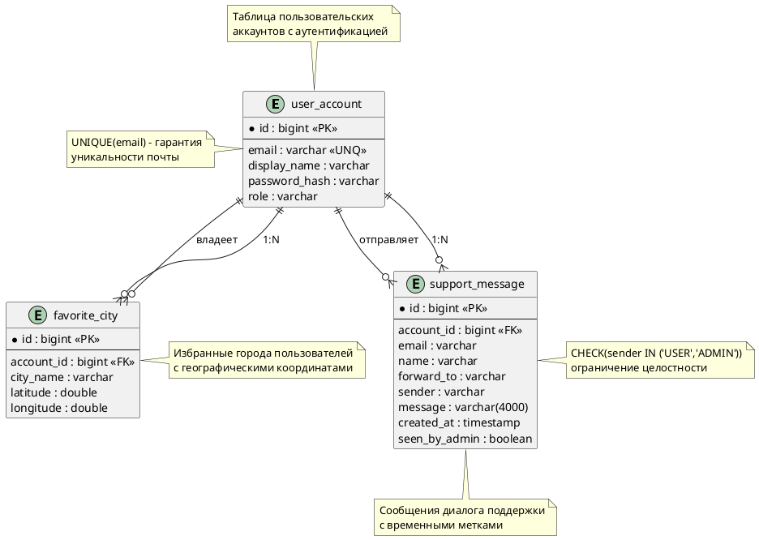

```plantuml
@startuml
entity user_account {
    *id : bigint <<PK>>
    --
    email : varchar <<UNQ>>
    display_name : varchar
    password_hash : varchar
    role : varchar
}

entity favorite_city {
    *id : bigint <<PK>>
    --
    account_id : bigint <<FK>>
    city_name : varchar
    latitude : double
    longitude : double
}

entity support_message {
    *id : bigint <<PK>>
    --
    account_id : bigint <<FK>>
    email : varchar
    name : varchar
    forward_to : varchar
    sender : varchar
    message : varchar(4000)
    created_at : timestamp
    seen_by_admin : boolean
}

user_account ||--o{ favorite_city : "владеет"
user_account ||--o{ favorite_city : "1:N"

user_account ||--o{ support_message : "отправляет"
user_account ||--o{ support_message : "1:N"

note top of user_account
  Таблица пользовательских
  аккаунтов с аутентификацией
end note

note right of favorite_city
  Избранные города пользователей
  с географическими координатами
end note

note bottom of support_message
  Сообщения диалога поддержки
  с временными метками
end note

note left of user_account
  UNIQUE(email) - гарантия
  уникальности почты
end note

note right of support_message
  CHECK(sender IN ('USER','ADMIN'))
  ограничение целостности
end note

@enduml
```
