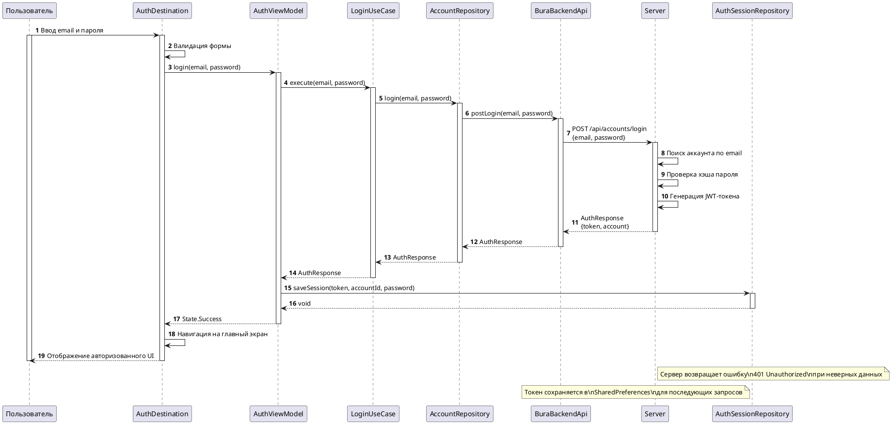

```plantuml
@startuml
autonumber

participant "Пользователь" as User
participant "AuthDestination" as UI
participant "AuthViewModel" as VM
participant "LoginUseCase" as UC
participant "AccountRepository" as Repo
participant "BuraBackendApi" as Api
participant "Server" as Server
participant "AuthSessionRepository" as Session

User -> UI : Ввод email и пароля
activate User
activate UI

UI -> UI : Валидация формы

UI -> VM : login(email, password)
activate VM

VM -> UC : execute(email, password)
activate UC

UC -> Repo : login(email, password)
activate Repo

Repo -> Api : postLogin(email, password)
activate Api

Api -> Server : POST /api/accounts/login\n{email, password}
activate Server

Server -> Server : Поиск аккаунта по email
Server -> Server : Проверка хэша пароля
Server -> Server : Генерация JWT-токена

Server --> Api : AuthResponse\n{token, account}
deactivate Server

Api --> Repo : AuthResponse
deactivate Api

Repo --> UC : AuthResponse
deactivate Repo

UC --> VM : AuthResponse
deactivate UC

VM -> Session : saveSession(token, accountId, password)
activate Session

Session --> VM : void
deactivate Session

VM --> UI : State.Success
deactivate VM

UI -> UI : Навигация на главный экран
UI --> User : Отображение авторизованного UI
deactivate UI
deactivate User

note right of Server
  Сервер возвращает ошибку\n401 Unauthorized\nпри неверных данных
end note

note left of Session
  Токен сохраняется в\nSharedPreferences\nдля последующих запросов
end note

@enduml
```