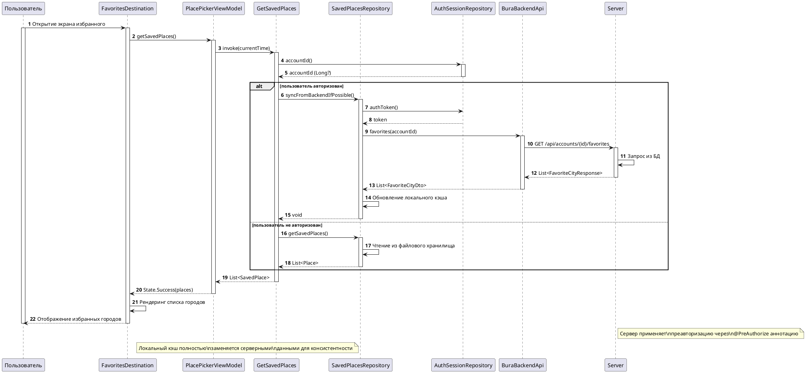

```plantuml
@startuml
autonumber

participant "Пользователь" as User
participant "FavoritesDestination" as UI
participant "PlacePickerViewModel" as VM
participant "GetSavedPlaces" as UC
participant "SavedPlacesRepository" as Repo
participant "AuthSessionRepository" as Auth
participant "BuraBackendApi" as Api
participant "Server" as Server

User -> UI : Открытие экрана избранного
activate User
activate UI

UI -> VM : getSavedPlaces()
activate VM

VM -> UC : invoke(currentTime)
activate UC

UC -> Auth : accountId()
activate Auth

Auth --> UC : accountId (Long?)
deactivate Auth

alt пользователь авторизован

    UC -> Repo : syncFromBackendIfPossible()
    activate Repo
    
    Repo -> Auth : authToken()
    Auth --> Repo : token
    deactivate Auth
    
    Repo -> Api : favorites(accountId)
    activate Api
    
    Api -> Server : GET /api/accounts/{id}/favorites
    activate Server
    
    Server -> Server : Запрос из БД
    Server --> Api : List<FavoriteCityResponse>
    deactivate Server
    
    Api --> Repo : List<FavoriteCityDto>
    deactivate Api
    
    Repo -> Repo : Обновление локального кэша
    Repo --> UC : void
    deactivate Repo

else пользователь не авторизован

    UC -> Repo : getSavedPlaces()
    activate Repo
    
    Repo -> Repo : Чтение из файлового хранилища
    Repo --> UC : List<Place>
    deactivate Repo

end

UC --> VM : List<SavedPlace>
deactivate UC

VM --> UI : State.Success(places)
deactivate VM

UI -> UI : Рендеринг списка городов
UI --> User : Отображение избранных городов
deactivate UI
deactivate User

note right of Server
  Сервер применяет\nпреавторизацию через\n@PreAuthorize аннотацию
end note

note left of Repo
  Локальный кэш полностью\nзаменяется серверными\nданными для консистентности
end note

@enduml
```
