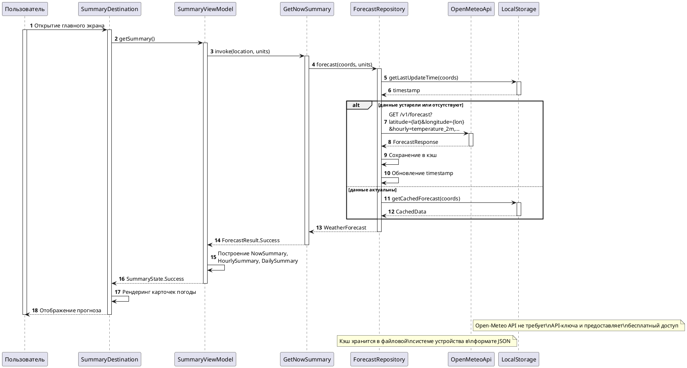

```plantuml
@startuml
autonumber

participant "Пользователь" as User
participant "SummaryDestination" as UI
participant "SummaryViewModel" as VM
participant "GetNowSummary" as UC
participant "ForecastRepository" as Repo
participant "OpenMeteoApi" as ExternalApi
participant "LocalStorage" as Cache

User -> UI : Открытие главного экрана
activate User
activate UI

UI -> VM : getSummary()
activate VM

VM -> UC : invoke(location, units)
activate UC

UC -> Repo : forecast(coords, units)
activate Repo

Repo -> Cache : getLastUpdateTime(coords)
activate Cache

Cache --> Repo : timestamp
deactivate Cache

alt данные устарели или отсутствуют

    Repo -> ExternalApi : GET /v1/forecast?\nlatitude={lat}&longitude={lon}\n&hourly=temperature_2m,...
    activate ExternalApi
    
    ExternalApi --> Repo : ForecastResponse
    deactivate ExternalApi
    
    Repo -> Repo : Сохранение в кэш
    Repo -> Repo : Обновление timestamp

else данные актуальны

    Repo -> Cache : getCachedForecast(coords)
    activate Cache
    Cache --> Repo : CachedData
    deactivate Cache

end

Repo --> UC : WeatherForecast
deactivate Repo

UC --> VM : ForecastResult.Success
deactivate UC

VM -> VM : Построение NowSummary,\nHourlySummary, DailySummary

VM --> UI : SummaryState.Success
deactivate VM

UI -> UI : Рендеринг карточек погоды
UI --> User : Отображение прогноза
deactivate UI
deactivate User

note right of ExternalApi
  Open-Meteo API не требует\nAPI-ключа и предоставляет\nбесплатный доступ
end note

note left of Cache
  Кэш хранится в файловой\nсистеме устройства в\nформате JSON
end note

@enduml
```
