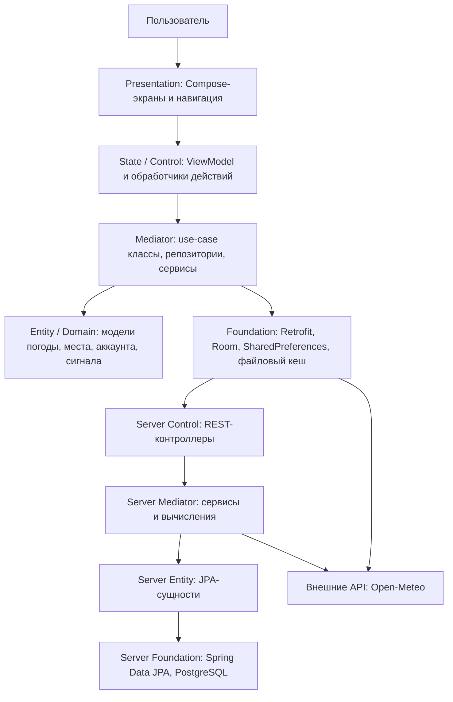

# Реализация слоёв проекта Bura

Документ описывает фактическую реализацию слоёв в проекте Bura: Android-клиенте на Kotlin/Jetpack Compose и серверной части на Java/Spring Boot. Проект использует слоистую архитектуру, близкую к PCMEF: пользовательский интерфейс отделён от состояния экранов, бизнес-сценариев, доменных моделей, инфраструктурных API и хранилищ данных.

## 1. Общая схема слоёв

| Слой | Android-клиент | Сервер | Назначение |
| --- | --- | --- | --- |
| Presentation | `*Destination`, `*Screen`, Compose-компоненты, `AppNavHost` | HTML-панель администратора в `AdminController` | Отображение данных и получение пользовательских действий. |
| State / Control | `*ViewModel`, навигационные маршруты, обработчики экранов | `@RestController`, Spring Security filter chain | Координация сценария запроса, проверка доступа, перевод пользовательского события в вызов бизнес-логики. |
| Mediator | `*Repository`, use-case классы `Get*`, `SearchPlaces`, `SelectPlace`, `AddPlaceToFavorites` | `AccountService`, вычисления в контроллерах поддержки/избранного/радиосигнала | Инкапсуляция бизнес-правил и объединение нескольких источников данных. |
| Entity / Domain | `Forecast`, `Place`, `Location`, value object-классы температуры, ветра, давления и т.д. | `UserAccountEntity`, `FavoriteCityEntity`, `SupportMessageEntity`, `RadioSignalTestEntity` | Предметные сущности и структуры данных. |
| Foundation | `BuraBackendApi`, `ApiProvider`, `BuraDatabase`, `BuraDao`, `ForecastDataDownloader`, `ForecastDataCacher`, `SharedPreferences` | Spring Data `JpaRepository`, PostgreSQL, `JwtService`, `RestClient` | Технические детали хранения, сети, авторизации и интеграций. |

## 2. Android-клиент

### 2.1. Presentation: экраны и навигация

Presentation-слой реализован на Jetpack Compose. За экраны отвечают файлы с суффиксами `Destination`, `Screen` и UI-компоненты внутри тематических пакетов:

- `summary` — главный экран прогноза: `SummaryDestination`, `SummaryScreen`, карточки сводки и почасового/дневного прогноза;
- `graphs` — экраны графиков температуры, осадков и вероятности осадков;
- `place.saved`, `place.picker`, `place.search` — избранные места, поиск и выбор локации;
- `account`, `auth`, `support`, `radio`, `settings` — аккаунт, авторизация, поддержка, тест радиосигнала и настройки;
- `common` — переиспользуемые визуальные элементы, тема, цвета, иконки и вспомогательные форматтеры.

Навигация собрана в `AppNavHost`: он хранит типизированные маршруты `AppRoutes`, проверяет состояние авторизации, показывает экран входа для неавторизованного пользователя и нижнюю навигацию для основных разделов приложения.

### 2.2. State / Control: ViewModel и состояние экранов

Состояние экранов вынесено в ViewModel-классы. Например, `SummaryViewModel`:

1. получает выбранное место из `SelectedPlaceRepository`;
2. получает выбранные единицы измерения из `SelectedUnitsRepository`;
3. запрашивает прогноз через `ForecastRepository`;
4. собирает отдельные summary-модели через функции `getNowSummary`, `getHourlySummary`, `getDailySummary`, `getWindSummary` и другие;
5. публикует результат в `StateFlow`, который читает Compose UI.

Такой подход отделяет UI от асинхронной загрузки, обработки ошибок и правил формирования экранной модели. Экран получает уже готовое состояние: загрузка, отсутствие выбранного места, ошибка скачивания, устаревшие данные или успешный набор виджетов.

### 2.3. Mediator: сценарии и репозитории

Mediator-слой клиента объединяет доменные операции и источники данных:

- `ForecastRepository` управляет политикой обновления прогноза (`Eager`, `Frugal`, `Static`), синхронизирует параллельные запросы по координатам через `Mutex`, берёт кеш из `ForecastDataCacher`, скачивает новые данные через `ForecastDataDownloader` и преобразует их в доменный `Forecast` через `ForecastConverter`.
- `SavedPlacesRepository` хранит избранные места локально в файловом кеше, а при наличии аккаунта синхронизирует их с сервером через `BuraBackendApi`.
- `AccountRepository` выполняет вход, регистрацию, изменение имени/пароля, загрузку статистики и удаление аккаунта, а также обновляет локальный Room-кеш аккаунта.
- `SupportRepository` и `RadioSignalRepository` инкапсулируют работу с обращениями в поддержку и историей тестов радиосигнала, используя удалённый API и локальную базу Room как fallback/кеш.
- Use-case классы `GetSavedPlaces`, `SearchPlaces`, `SelectPlace`, `AddPlaceToFavorites`, `DeletePlace` дают ViewModel и экранам короткие операции без знания деталей хранения.

### 2.4. Entity / Domain: предметная модель клиента

Доменная модель клиента находится в пакетах по погодным понятиям и пользовательским сценариям:

- `forecast` — агрегат `Forecast`, сырые данные `ForecastData`, результат `ForecastResult`, периоды и моменты прогноза;
- `temperature`, `wind`, `gust`, `pressure`, `humidity`, `visibility`, `uvindex`, `precipitation`, `pop`, `sun`, `condition` — value object-классы, единицы измерения, периоды и форматирование;
- `place` — `Place`, `Location`, `Coordinates` и связанные операции выбора/поиска;
- `platform.local` — Room-сущности для локального хранения аккаунта, избранных городов, обращений поддержки и тестов радиосигнала.

Погодные величины не передаются по UI как примитивы. Например, температура, скорость ветра и давление имеют собственные классы с единицами измерения и методами конвертации. Это снижает риск смешать разные единицы и упрощает поддержку пользовательских настроек.

### 2.5. Foundation: сеть, кеши и локальное хранение

Foundation-слой клиента скрывает технические детали:

- `BuraBackendApi` описывает REST-контракт с сервером Retrofit-аннотациями: авторизация, аккаунты, избранные города, поддержка, тесты радиосигнала и статистика.
- `ApiProvider` создаёт Retrofit/OkHttp-клиент, добавляет JWT-токен в заголовок `Authorization`, логирует HTTP-запросы и очищает сессию при ответе `401`.
- `BuraDatabase` и `BuraDao` реализуют локальную Room-базу `bura-room.db` для данных аккаунта, избранного, поддержки и радиотестов.
- `AuthSessionRepository`, `SelectedPlaceRepository`, `SelectedUnitsRepository` используют `SharedPreferences` для лёгкого локального состояния.
- `ForecastDataDownloader` обращается к Open-Meteo, нормализует JSON-ответ и защищает приложение от сетевых ошибок возвратом `null`.
- `ForecastDataCacher` сохраняет прогнозы в файловый кеш `forecasts`, чтобы приложение могло работать быстрее и переживать временную недоступность сети.

## 3. Серверная часть

### 3.1. Server Control: REST API и безопасность

Сервер реализован на Spring Boot. Входной слой состоит из REST-контроллеров:

- `AccountController` — регистрация, вход, чтение и изменение профиля, смена пароля, удаление аккаунта;
- `FavoriteCityController` — HTTP-маршруты CRUD для избранных городов пользователя, делегирующие `FavoriteCityService`;
- `SupportController` — HTTP-маршруты сообщений пользователя и администратора, делегирующие `SupportService`;
- `RadioSignalController` — HTTP-маршруты запуска теста радиосигнала и получения истории, делегирующие `RadioSignalService`;
- `UserStatsController` — HTTP-маршрут агрегированной статистики аккаунта, делегирующий `UserStatsService`;
- `AdminController` — административные HTTP-маршруты, делегирующие `AdminService`, и HTML-панель поддержки.

Доступ защищён Spring Security. `SecurityConfig` разрешает публично только Swagger и `/api/auth/**`, а остальные запросы требуют аутентификации. `JwtAuthFilter` извлекает Bearer-токен, валидирует его через `JwtService` и помещает `userId` и роль в `SecurityContext`. Точечная авторизация выполняется аннотациями `@PreAuthorize`, например через `@accountAccess.canAccess(#accountId, authentication)`.

### 3.2. Server Mediator: бизнес-логика

Бизнес-логика сервера сосредоточена в service-слое:

- `AccountService` регистрирует пользователей, проверяет уникальность email, хеширует пароль BCrypt, выдаёт JWT, синхронизирует роль пользователя со списком администраторов и удаляет связанные данные аккаунта в одной транзакции.
- `RadioSignalService` рассчитывает дистанцию по формуле haversine, потери свободного пространства, задержку сигнала, примерную скорость и классификацию качества канала. Для поправки на условия распространения он запрашивает текущую погоду в Open-Meteo через `RestClient`.
- `SupportService` формирует диалоги поддержки, отмечает сообщения прочитанными для администратора и разделяет пользовательские и администраторские сообщения.
- `FavoriteCityService`, `UserStatsService` и `AdminService` инкапсулируют операции с избранными городами, агрегированную статистику, dashboard-метрики, список аккаунтов и смену ролей.

### 3.3. Server Entity: JPA-сущности

Серверные сущности отображаются на таблицы PostgreSQL через JPA:

- `UserAccountEntity` → `user_account`: email, отображаемое имя, BCrypt-хеш пароля, роль `USER`/`ADMIN`;
- `FavoriteCityEntity` → избранный город: владелец `accountId`, название города, широта и долгота;
- `SupportMessageEntity` → сообщения поддержки: отправитель, контактные данные, текст, время создания, признак прочтения администратором;
- `RadioSignalTestEntity` → история тестов радиосигнала: города, расстояние, потери, качество и время создания.

DTO реализованы Java records внутри `AccountDtos`, контроллеров для входных запросов и сервисов для ответов. Они отделяют внешний JSON-контракт от JPA-сущностей и не раскрывают технические поля вроде `passwordHash`.

### 3.4. Server Foundation: репозитории, БД и интеграции

Слой Foundation сервера включает:

- Spring Data JPA-репозитории `UserAccountRepository`, `FavoriteCityRepository`, `SupportMessageRepository`, `RadioSignalTestRepository`;
- PostgreSQL как основное постоянное хранилище;
- `JwtService` для создания и проверки JWT;
- `PasswordEncoder` на BCrypt для безопасного хранения паролей;
- `RestClient` для обращения к Open-Meteo при расчёте качества радиосигнала;
- Springdoc OpenAPI/Swagger для документации REST API.

## 4. Основные потоки данных

### 4.1. Загрузка прогноза погоды

1. Пользователь открывает главный экран прогноза.
2. `SummaryDestination` создаёт `SummaryViewModel` и подписывается на состояние.
3. `SummaryViewModel` берёт выбранное место и единицы измерения.
4. `ForecastRepository` проверяет кеш по координатам и политике обновления.
5. Если кеш отсутствует или устарел, `ForecastDataDownloader` скачивает данные Open-Meteo.
6. `ForecastDataCacher` сохраняет сырые данные, `ForecastConverter` переводит их в `Forecast`.
7. Функции `get*Summary` формируют экранные модели, а Compose-компоненты отображают результат.

### 4.2. Авторизация пользователя

1. Экран авторизации вызывает `AccountRepository.login` или `AccountRepository.register`.
2. Репозиторий отправляет запрос в `BuraBackendApi`.
3. `AccountController` принимает JSON-запрос и передаёт его в `AccountService`.
4. `AccountService` проверяет пароль/создаёт аккаунт, формирует JWT через `JwtService` и возвращает DTO.
5. Клиент сохраняет аккаунт в Room, а токен и id аккаунта — в `AuthSessionRepository`.
6. `ApiProvider` добавляет токен к последующим запросам.

### 4.3. Синхронизация избранных мест

1. Пользователь добавляет место в избранное.
2. Use-case `AddPlaceToFavorites` вызывает `SavedPlacesRepository.savePlace`.
3. Если пользователь авторизован, репозиторий отправляет город на сервер через `api.addFavorite`.
4. Независимо от сервера место сохраняется в файловый кеш клиента.
5. При чтении избранного `SavedPlacesRepository.getSavedPlaces` пытается синхронизировать список с backend, а при ошибке использует локальные файлы.

### 4.4. Тест радиосигнала

1. Клиентский `RadioSignalRepository.run` отправляет две точки и частоту на `/api/accounts/{accountId}/radio-tests`.
2. `JwtAuthFilter` аутентифицирует пользователя, `@PreAuthorize` проверяет право доступа к аккаунту.
3. `RadioSignalController` передаёт запрос в `RadioSignalService`, который рассчитывает расстояние, получает погодные поправки, вычисляет path loss, latency, speed и quality.
4. Результат сохраняется в `RadioSignalTestRepository` и возвращается клиенту.
5. Клиент сохраняет ответ в Room и показывает результат/историю на экране радиосигнала.

## 5. Правила зависимостей между слоями

- UI не обращается напрямую к Retrofit, Room, файлам или Spring API; он работает с ViewModel и готовыми state-моделями.
- ViewModel не знает деталей HTTP/SQL/файлового формата; она использует репозитории и use-case классы.
- Доменные классы погоды и мест не зависят от Android UI и сетевых DTO.
- Foundation-классы могут знать о конкретных технологиях, но не должны содержать логику отображения.
- Серверные контроллеры принимают/возвращают DTO и делегируют устойчивую бизнес-логику сервисам или репозиториям.
- JPA-сущности не отправляются клиенту напрямую, чтобы внешний контракт не зависел от структуры таблиц.

## 6. Соответствие модулей слоям

| Пакет / файл | Слой | Комментарий |
| --- | --- | --- |
| `app/src/main/java/com/docesforg/bura/AppNavHost.kt` | Presentation / Control | Маршрутизация, нижняя навигация и выбор стартового экрана по состоянию авторизации. |
| `app/src/main/java/com/docesforg/bura/AppContainer.kt` | Composition root | Создаёт и связывает репозитории, API-клиент, Room и use-case классы. |
| `app/src/main/java/com/docesforg/bura/summary/*Destination.kt`, `*Screen.kt` | Presentation | Экранная композиция и отображение прогноза. |
| `app/src/main/java/com/docesforg/bura/summary/*ViewModel.kt` | State / Control | Асинхронная загрузка и подготовка состояния экрана. |
| `app/src/main/java/com/docesforg/bura/forecast/ForecastRepository.kt` | Mediator | Политика обновления прогноза, кеширование, скачивание, конвертация. |
| `app/src/main/java/com/docesforg/bura/forecast/ForecastDataDownloader.kt` | Foundation | HTTP-интеграция с Open-Meteo. |
| `app/src/main/java/com/docesforg/bura/forecast/ForecastDataCacher.kt` | Foundation | Файловый кеш прогноза. |
| `app/src/main/java/com/docesforg/bura/platform/remote/*` | Foundation | Retrofit-контракт и HTTP-клиент backend. |
| `app/src/main/java/com/docesforg/bura/platform/local/BuraDatabase.kt` | Foundation / локальные Entity | Room-сущности, DAO и локальная база. |
| `server/src/main/java/com/docesforg/bura/server/*/*Controller.java` | Server Control | REST API, валидация, авторизация на уровне методов. |
| `server/src/main/java/com/docesforg/bura/server/account/AccountService.java` | Server Mediator | Регистрация, вход, роли, JWT, транзакционное удаление аккаунта. |
| `server/src/main/java/com/docesforg/bura/server/*/*Entity.java` | Server Entity | JPA-модель таблиц PostgreSQL. |
| `server/src/main/java/com/docesforg/bura/server/*/*Repository.java` | Server Foundation | Spring Data JPA-доступ к данным. |
| `server/src/main/java/com/docesforg/bura/server/security/*` | Foundation / Security | JWT, BCrypt, security filter chain и проверка доступа. |

## 7. Итог

Реализация проекта поддерживает разделение ответственности: Compose-экраны отвечают только за представление, ViewModel — за состояние, репозитории и use-case классы — за сценарии приложения, доменные модели — за предметные понятия, а Foundation-слой — за сеть, кеши, базу данных и безопасность. Серверная часть повторяет тот же принцип через REST-контроллеры, сервисы, JPA-сущности и репозитории. Благодаря этому отдельные части проекта можно развивать и тестировать независимо: например, погодные summary-функции тестируются без UI, а серверные сервисы и контроллеры — без Android-клиента.
