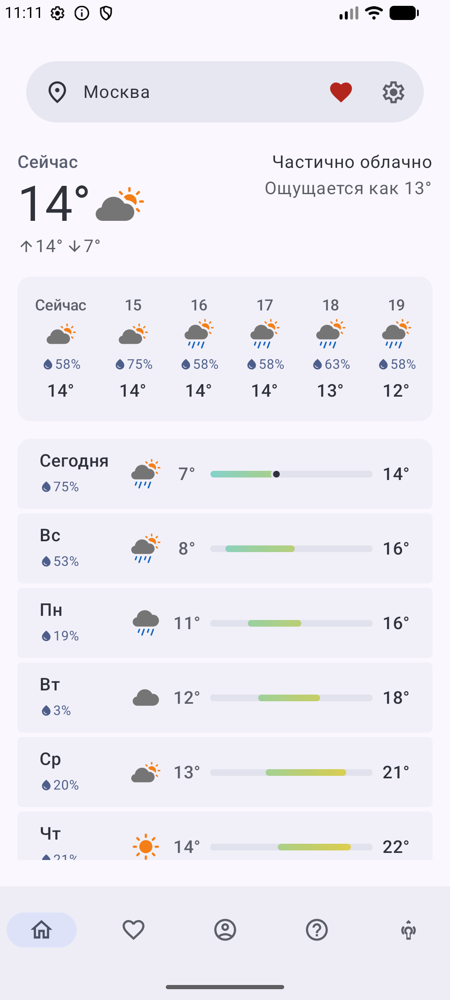
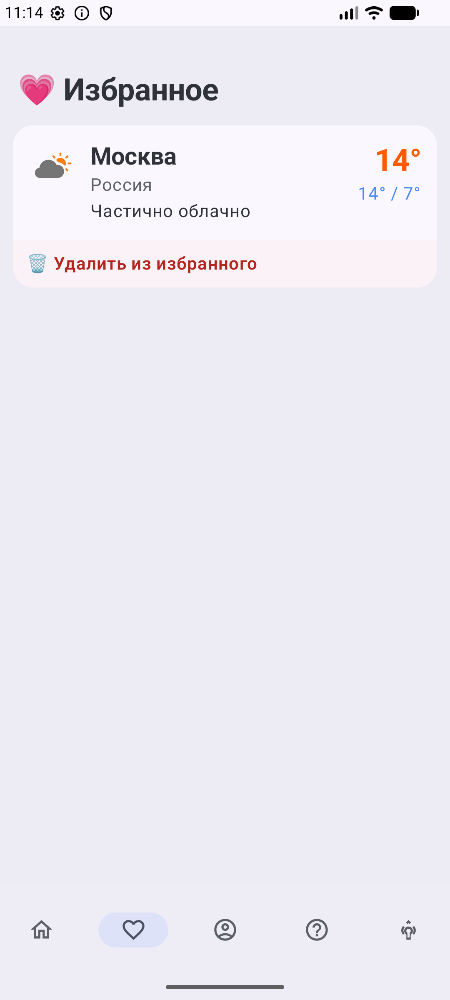
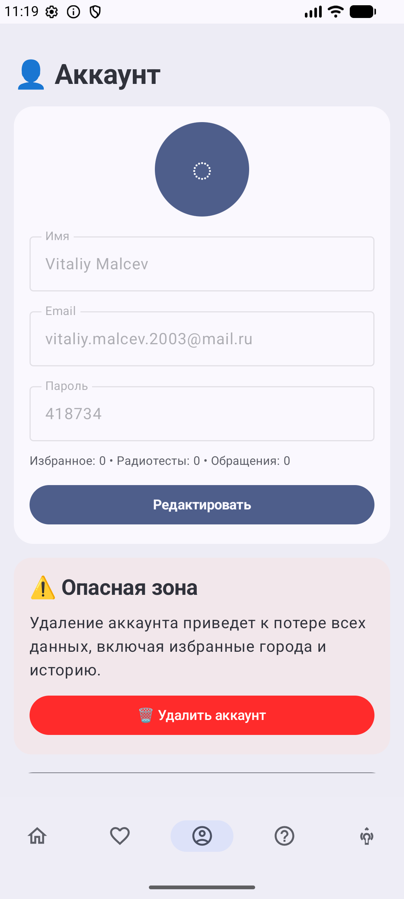
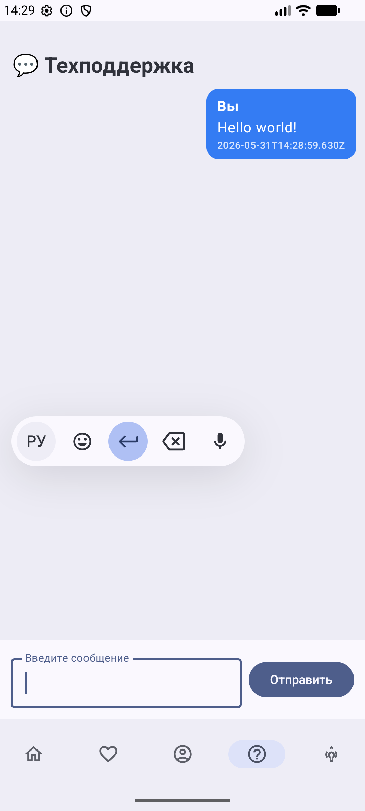
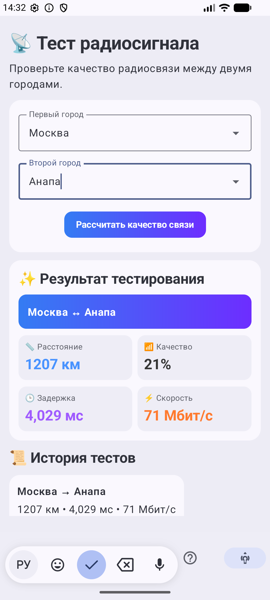

# UI-экраны приложения

В этой папке собраны скриншоты основных экранов мобильного интерфейса погодного приложения. Каждый раздел ниже описывает назначение экрана и ключевые элементы, которые видит пользователь.

## Главная

Главный экран показывает погоду для выбранного города. В верхней части расположен блок выбора локации с текущим городом, кнопкой добавления в избранное и переходом в настройки. Ниже отображаются текущая температура, погодное состояние, ощущаемая температура, дневной максимум и минимум. Дополнительно экран содержит почасовой прогноз с вероятностью осадков и список прогноза по дням с температурными диапазонами.

## Избранное

Экран избранных городов содержит список сохранённых пользователем локаций. Карточка города показывает название, страну, краткое описание погоды, текущую температуру и дневной диапазон температур. В нижней части карточки находится действие удаления города из избранного.

## Аккаунт

Экран аккаунта предназначен для просмотра и управления данными профиля. На нём отображаются аватар, имя пользователя, email и пароль, а также сводные счётчики по избранным городам, радиотестам и обращениям. Кнопка «Редактировать» открывает изменение данных профиля. Отдельный блок «Опасная зона» предупреждает о последствиях удаления аккаунта и содержит кнопку удаления.

## Техподдержка

Экран техподдержки реализован как чат с обращениями пользователя. В основной области отображается история сообщений с автором, текстом и временем отправки. Внизу находится поле ввода сообщения и кнопка отправки, позволяющие создать новое обращение в поддержку.

## Тест радиосигнала

Экран теста радиосигнала позволяет оценить качество радиосвязи между двумя городами. Пользователь выбирает первый и второй город, после чего запускает расчёт качества связи. Результат показывает пару городов, расстояние, процент качества, задержку и скорость соединения. Ниже отображается история выполненных тестов.

