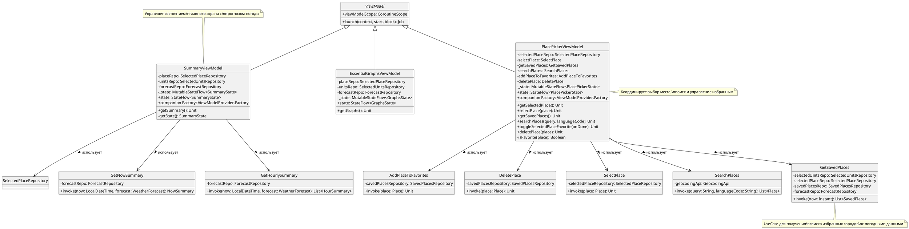

```plantuml
@startuml
skinparam classAttributeIconSize 0
hide circle

abstract class ViewModel {
    +viewModelScope: CoroutineScope
    +launch(context, start, block): Job
}

class SummaryViewModel {
    -placeRepo: SelectedPlaceRepository
    -unitsRepo: SelectedUnitsRepository
    -forecastRepo: ForecastRepository
    -_state: MutableStateFlow<SummaryState>
    +state: StateFlow<SummaryState>
    +getSummary(): Unit
    -getState(): SummaryState
    +companion Factory: ViewModelProvider.Factory
}

class PlacePickerViewModel {
    -selectedPlaceRepo: SelectedPlaceRepository
    -selectPlace: SelectPlace
    -getSavedPlaces: GetSavedPlaces
    -searchPlaces: SearchPlaces
    -addPlaceToFavorites: AddPlaceToFavorites
    -deletePlace: DeletePlace
    -_state: MutableStateFlow<PlacePickerState>
    +state: StateFlow<PlacePickerState>
    +getSelectedPlace(): Unit
    +selectPlace(place): Unit
    +getSavedPlaces(): Unit
    +searchPlaces(query, languageCode): Unit
    +toggleSelectedPlaceFavorite(onDone): Unit
    +deletePlace(place): Unit
    -isFavorite(place): Boolean
    +companion Factory: ViewModelProvider.Factory
}

class EssentialGraphsViewModel {
    -placeRepo: SelectedPlaceRepository
    -unitsRepo: SelectedUnitsRepository
    -forecastRepo: ForecastRepository
    -_state: MutableStateFlow<GraphsState>
    +state: StateFlow<GraphsState>
    +getGraphs(): Unit
}

class GetSavedPlaces {
    -selectedUnitsRepo: SelectedUnitsRepository
    -selectedPlaceRepo: SelectedPlaceRepository
    -savedPlacesRepo: SavedPlacesRepository
    -forecastRepo: ForecastRepository
    +invoke(now: Instant): List<SavedPlace>
}

class AddPlaceToFavorites {
    -savedPlacesRepository: SavedPlacesRepository
    +invoke(place: Place): Unit
}

class DeletePlace {
    -savedPlacesRepository: SavedPlacesRepository
    +invoke(place: Place): Unit
}

class SelectPlace {
    -selectedPlaceRepository: SelectedPlaceRepository
    +invoke(place: Place): Unit
}

class SearchPlaces {
    -geocodingApi: GeocodingApi
    +invoke(query: String, languageCode: String): List<Place>
}

class GetNowSummary {
    -forecastRepo: ForecastRepository
    +invoke(now: LocalDateTime, forecast: WeatherForecast): NowSummary
}

class GetHourlySummary {
    -forecastRepo: ForecastRepository
    +invoke(now: LocalDateTime, forecast: WeatherForecast): List<HourSummary>
}

ViewModel <|-- SummaryViewModel
ViewModel <|-- PlacePickerViewModel
ViewModel <|-- EssentialGraphsViewModel

SummaryViewModel --> GetNowSummary : использует >
SummaryViewModel --> GetHourlySummary : использует >
SummaryViewModel --> SelectedPlaceRepository : использует >

PlacePickerViewModel --> GetSavedPlaces : использует >
PlacePickerViewModel --> AddPlaceToFavorites : использует >
PlacePickerViewModel --> DeletePlace : использует >
PlacePickerViewModel --> SelectPlace : использует >
PlacePickerViewModel --> SearchPlaces : использует >

note top of SummaryViewModel
  Управляет состоянием\nглавного экрана с\nпрогнозом погоды
end note

note right of PlacePickerViewModel
  Координирует выбор места,\nпоиск и управление избранным
end note

note bottom of GetSavedPlaces
  UseCase для получения\nсписка избранных городов\nс погодными данными
end note

@enduml
```