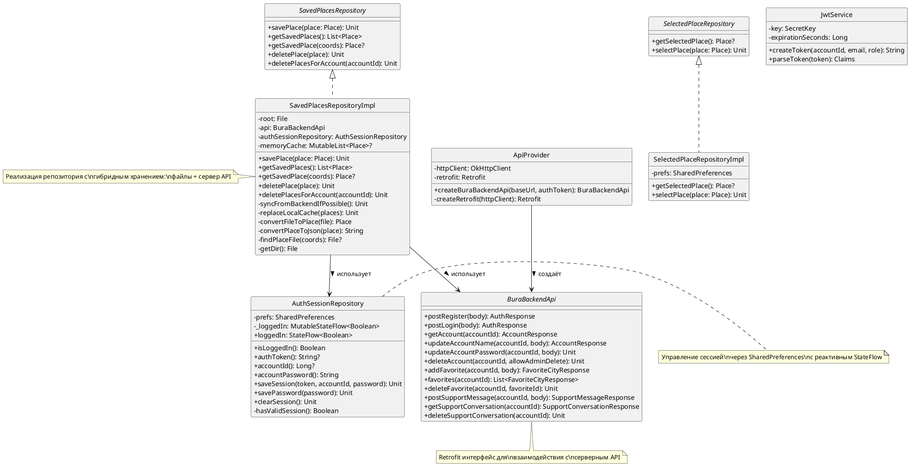

```plantuml
@startuml
skinparam classAttributeIconSize 0
hide circle

interface SavedPlacesRepository {
    +savePlace(place: Place): Unit
    +getSavedPlaces(): List<Place>
    +getSavedPlace(coords): Place?
    +deletePlace(place): Unit
    +deletePlacesForAccount(accountId): Unit
}

class SavedPlacesRepositoryImpl {
    -root: File
    -api: BuraBackendApi
    -authSessionRepository: AuthSessionRepository
    -memoryCache: MutableList<Place>?
    +savePlace(place: Place): Unit
    +getSavedPlaces(): List<Place>
    +getSavedPlace(coords): Place?
    +deletePlace(place): Unit
    +deletePlacesForAccount(accountId): Unit
    -syncFromBackendIfPossible(): Unit
    -replaceLocalCache(places): Unit
    -convertFileToPlace(file): Place
    -convertPlaceToJson(place): String
    -findPlaceFile(coords): File?
    -getDir(): File
}

interface SelectedPlaceRepository {
    +getSelectedPlace(): Place?
    +selectPlace(place: Place): Unit
}

class SelectedPlaceRepositoryImpl {
    -prefs: SharedPreferences
    +getSelectedPlace(): Place?
    +selectPlace(place: Place): Unit
}

class AuthSessionRepository {
    -prefs: SharedPreferences
    -_loggedIn: MutableStateFlow<Boolean>
    +loggedIn: StateFlow<Boolean>
    +isLoggedIn(): Boolean
    +authToken(): String?
    +accountId(): Long?
    +accountPassword(): String
    +saveSession(token, accountId, password): Unit
    +savePassword(password): Unit
    +clearSession(): Unit
    -hasValidSession(): Boolean
}

interface BuraBackendApi {
    +postRegister(body): AuthResponse
    +postLogin(body): AuthResponse
    +getAccount(accountId): AccountResponse
    +updateAccountName(accountId, body): AccountResponse
    +updateAccountPassword(accountId, body): Unit
    +deleteAccount(accountId, allowAdminDelete): Unit
    +addFavorite(accountId, body): FavoriteCityResponse
    +favorites(accountId): List<FavoriteCityResponse>
    +deleteFavorite(accountId, favoriteId): Unit
    +postSupportMessage(accountId, body): SupportMessageResponse
    +getSupportConversation(accountId): SupportConversationResponse
    +deleteSupportConversation(accountId): Unit
}

class ApiProvider {
    -httpClient: OkHttpClient
    -retrofit: Retrofit
    +createBuraBackendApi(baseUrl, authToken): BuraBackendApi
    -createRetrofit(httpClient): Retrofit
}

class JwtService {
    -key: SecretKey
    -expirationSeconds: Long
    +createToken(accountId, email, role): String
    +parseToken(token): Claims
}

SavedPlacesRepository <|.. SavedPlacesRepositoryImpl
SelectedPlaceRepository <|.. SelectedPlaceRepositoryImpl

SavedPlacesRepositoryImpl --> AuthSessionRepository : использует >
SavedPlacesRepositoryImpl --> BuraBackendApi : использует >

ApiProvider --> BuraBackendApi : создаёт >

note left of SavedPlacesRepositoryImpl
  Реализация репозитория с\nгибридным хранением:\nфайлы + сервер API
end note

note right of AuthSessionRepository
  Управление сессией\nчерез SharedPreferences\nс реактивным StateFlow
end note

note bottom of BuraBackendApi
  Retrofit интерфейс для\nвзаимодействия с\nсерверным API
end note

@enduml
```
