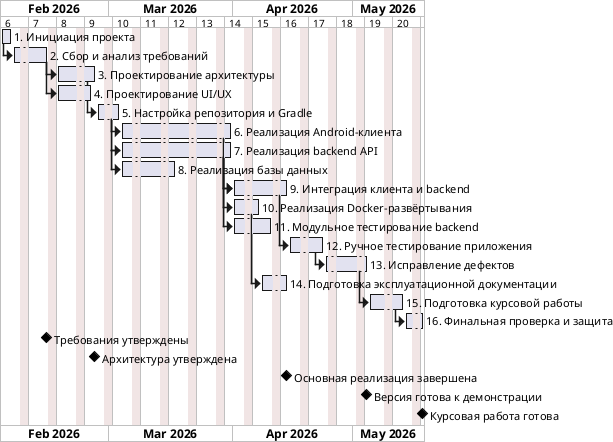

```plantuml
@startgantt
' Диаграмма Ганта для проекта Bura
' План рассчитан на 12 учебных недель

Project starts 2026-02-02
saturday are closed
sunday are closed

printscale weekly

[1. Инициация проекта] lasts 3 days
[2. Сбор и анализ требований] lasts 7 days
[2. Сбор и анализ требований] starts at [1. Инициация проекта]'s end

[3. Проектирование архитектуры] lasts 8 days
[3. Проектирование архитектуры] starts at [2. Сбор и анализ требований]'s end

[4. Проектирование UI/UX] lasts 7 days
[4. Проектирование UI/UX] starts at [2. Сбор и анализ требований]'s end

[5. Настройка репозитория и Gradle] lasts 4 days
[5. Настройка репозитория и Gradle] starts at [3. Проектирование архитектуры]'s end

[6. Реализация Android-клиента] lasts 20 days
[6. Реализация Android-клиента] starts at [5. Настройка репозитория и Gradle]'s end

[7. Реализация backend API] lasts 20 days
[7. Реализация backend API] starts at [5. Настройка репозитория и Gradle]'s end

[8. Реализация базы данных] lasts 10 days
[8. Реализация базы данных] starts at [7. Реализация backend API]'s start

[9. Интеграция клиента и backend] lasts 10 days
[9. Интеграция клиента и backend] starts at [6. Реализация Android-клиента]'s end
[9. Интеграция клиента и backend] starts at [7. Реализация backend API]'s end

[10. Реализация Docker-развёртывания] lasts 5 days
[10. Реализация Docker-развёртывания] starts at [7. Реализация backend API]'s end

[11. Модульное тестирование backend] lasts 8 days
[11. Модульное тестирование backend] starts at [7. Реализация backend API]'s end

[12. Ручное тестирование приложения] lasts 7 days
[12. Ручное тестирование приложения] starts at [9. Интеграция клиента и backend]'s end

[13. Исправление дефектов] lasts 7 days
[13. Исправление дефектов] starts at [12. Ручное тестирование приложения]'s end

[14. Подготовка эксплуатационной документации] lasts 5 days
[14. Подготовка эксплуатационной документации] starts at [10. Реализация Docker-развёртывания]'s end

[15. Подготовка курсовой работы] lasts 7 days
[15. Подготовка курсовой работы] starts at [13. Исправление дефектов]'s end

[16. Финальная проверка и защита] lasts 3 days
[16. Финальная проверка и защита] starts at [15. Подготовка курсовой работы]'s end

' Контрольные точки
[Требования утверждены] happens at [2. Сбор и анализ требований]'s end
[Архитектура утверждена] happens at [3. Проектирование архитектуры]'s end
[Основная реализация завершена] happens at [9. Интеграция клиента и backend]'s end
[Версия готова к демонстрации] happens at [13. Исправление дефектов]'s end
[Курсовая работа готова] happens at [16. Финальная проверка и защита]'s end

@endgantt
```
